- [過去の質問(2020年度)](#過去の質問2020年度)
    - [[mac] cmakeで*.xcodeprojが生成されない](#mac-cmakeでxcodeprojが生成されない)
    - [[mac] ”argument value 10880 is outside the valid range [0, 255]&quot;というエラーが出る](#mac-”argument-value-10880-is-outside-the-valid-range-0-255quotというエラーが出る)
    - [[mac] mac環境でサンプルプログラムの日本語コメントが文字化けする](#mac-mac環境でサンプルプログラムの日本語コメントが文字化けする)
    - [VS2017で"～が開けません"というエラーが大量に出る](#vs2017で～が開けませんというエラーが大量に出る)
    - [quaternionの式におけるθはradianですか?](#quaternionの式におけるθはradianですか)
    - [VS2019で "RuntimeLibrary" の不一致が検出されました とエラーが出る](#vs2019で-runtimelibrary-の不一致が検出されました-とエラーが出る)
    - [[mac] xcodeでのlibファイル生成場所？](#mac-xcodeでのlibファイル生成場所？)
    - [[mac] shared\incへコピーするファイルについて](#mac-sharedincへコピーするファイルについて)
    - [VS2017で include ファイルを開けません。 などのエラーが多発する](#vs2017で-include-ファイルを開けません。-などのエラーが多発する)
    - [btQuaternionのメンバーではありませんというエラーが出る](#btquaternionのメンバーではありませんというエラーが出る)
    - [[mac] ld: library not found for -lBulletDynamics というエラーが出る](#mac-ld-library-not-found-for--lbulletdynamics-というエラーが出る)
    - [[mac] xcodeでThread 1: signal SIGABRTというエラーが出る](#mac-xcodeでthread-1-signal-sigabrtというエラーが出る)
    - [関数InitBulletを定義するだけでエラーがたくさん出てくる](#関数initbulletを定義するだけでエラーがたくさん出てくる)
    - [[mac] xcodeで Undefined symbols for architecture というエラーが出る](#mac-xcodeで-undefined-symbols-for-architecture-というエラーが出る)
    - [[mac] freeglut関係のインクルードでエラーが出る](#mac-freeglut関係のインクルードでエラーが出る)
    - [衝突検出の練習問題４で衝突検出結果がおかしい](#衝突検出の練習問題４で衝突検出結果がおかしい)
    - [衝突フィルタリングについて](#衝突フィルタリングについて)
    - [[mac] ライブラリのリンクが一定時間で切れたり、プロジェクト起動時に再設定しなければならない](#mac-ライブラリのリンクが一定時間で切れたり、プロジェクト起動時に再設定しなければならない)
    - [＆演算子について](#＆演算子について)
    - [「４．剛体間リンク」の練習問題2でforce1の初期値が大きい？](#「４．剛体間リンク」の練習問題2でforce1の初期値が大きい？)
    - [Hinge2 Constraintの変数の形式が違うというエラーが出る](#hinge2-constraintの変数の形式が違うというエラーが出る)
    - [Hinge Constraintの軸設定](#hinge-constraintの軸設定)
    - [種類の違う複数のConstraintを一括で扱える型はあるのか？](#種類の違う複数のconstraintを一括で扱える型はあるのか？)
    - [objファイルはどこにおいたらいい？](#objファイルはどこにおいたらいい？)
    - [RxModel::Readが上手く動かない？](#rxmodelreadが上手く動かない？)
    - [[mac] rx_model.hをインクルードするとエラーが出る](#mac-rx_modelhをインクルードするとエラーが出る)
    - [未解決の外部シンボル "void _cdecl RxModel::Read(～"というエラーが出る](#未解決の外部シンボル-void-_cdecl-rxmodelread～というエラーが出る)
    - [3Dモデルの読み込みでの変数定義について](#3dモデルの読み込みでの変数定義について)
    - [3Dモデルのスケールが描画に反映されない](#3dモデルのスケールが描画に反映されない)
    - [キネティック物体の回転はどう書けば良いのか？](#キネティック物体の回転はどう書けば良いのか？)
    - [キネティック物体を直接動かしても当たり判定の位置が変わらない？](#キネティック物体を直接動かしても当たり判定の位置が変わらない？)
    - [床を回転させるとその上のオブジェクトが飛ばされてしまう](#床を回転させるとその上のオブジェクトが飛ばされてしまう)
    - [視点の初期化について](#視点の初期化について)
    - [オブジェクトの前方方向を表す単位ベクトルを取得したい](#オブジェクトの前方方向を表す単位ベクトルを取得したい)
    - [読み込めるワールドの広さを広くしたい](#読み込めるワールドの広さを広くしたい)
    - [Projection関数？](#projection関数？)
    - [衝突点の描画でエラーが出る](#衝突点の描画でエラーが出る)
    - [レポートの表紙の概要欄には何を記述すればよい？](#レポートの表紙の概要欄には何を記述すればよい？)


# 過去の質問(2020年度)

## [mac] cmakeで*.xcodeprojが生成されない
第一回スライドに載せられていたページ([http://blog.livedoor.jp/tek_nishi/archives/10156724.html](http://blog.livedoor.jp/tek_nishi/archives/10156724.html))の手順で作業していたのですが(macです)、ページの説明ではcmakeでgenerateしたのちにBULLET_PHYSICS.xcodeprojが生成されていますが、何度か試しましたが画像のようにしか生成されませんでした。対処法はありますか。
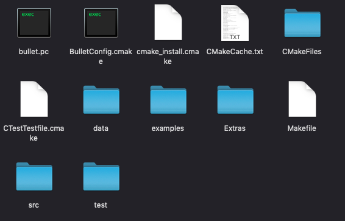 
<dl>
	<dt>[2020/05/12 13:42] 藤澤誠</dt>
	<dd>うーん，Macの設定が分からないので間違っているかもしれませんが，configureかgenerateを押したときに開発環境を選ぶダイアログが出たと思うのでそこでXcodeにしていないとかですかね？その場合，GUI版Cmake使っているならばFile -&gt; Delete Cacheした後に再度configureとかで開発環境を再設定できます．</dd>
</dl>
<dl>
	<dt>[2020/05/12 14:13] 学生</dt>
	<dd>ありがとうございます<br />
	configure時にXcodeの指定をしていなかったのでDelete Catheした後Xcodeの指定をしてconfigureしたところ&quot;Error in configuration process, project files may be invalid&quot;となってしまいました、、<br />
	（先回はこのエラーは表示されませんでした）</dd>
</dl>
<dl>
	<dt>​[2020/05/12 14:18] 藤澤誠</dt>
	<dd>キャッシュとかがまだ残ってそうなので，一旦ファイルを削除して，ファイルの解凍からやり直してみてください．</dd>
</dl>
<dl>
	<dt>[2020/05/12 18:53] 学生</dt>
	<dd>再度やり直してみましたが変わりませんでした<br />
	以下のようなエラーが出るのですがコンパイラの問題でしょうか<br />
	CMake Error at CMakeLists.txt:7 (PROJECT): No CMAKE_C_COMPILER could be found.<br />
	CMake Error at CMakeLists.txt:7 (PROJECT): No CMAKE_CXX_COMPILER could be found.</dd>
</dl>
<dl>
	<dt>[2020/05/12 19:45] 藤澤誠</dt>
	<dd>うーん，少し調べてみたらXcodeのパス指定がおかしい場合に起こっているエラーのようです．<br />>
	[MacでThe CXX compiler identification is unknown や CMAKE_CXX_COMPILER could be foundが出たときの対応 - Qiita](https://qiita.com/pakiln/items/612da90ca6a606e7648c)<br />
	↑のページが参考になるかもしれません．</dd>
<dl>
	<dt>[2020/05/12 19:56] TA</dt>
	<dd>僕も以前そのエラーが出たのですが、藤澤先生が挙げられたqiitaの記事にある通り、ターミナルで sudo xcode-select --reset と入力すれば解決しました。</dd>
</dl>
<dl>
	<dt>[2020/05/12 20:45] 学生</dt>
	<dd>上手くできました！<br />
	ありがとうございました。</dd>
</dl>

## [mac] ”argument value 10880 is outside the valid range [0, 255]&quot;というエラーが出る
コンパイルの際に, 以下のようなエラーがでます。<br />
0x80=128が[0,255]の範囲外だといわれます。<br />
昨日bullet physicsをbuildした際にも同様のエラーがでており、どうやら本来の値に85をかけた値として認識されているようなのですが、これについてわかるかたいらっしゃいますか？<br />
```
/Users/~/iml_physics/shared/inc/LinearMath/btVector3.h:330:7:<br />

error:
argument value 10880 is outside the valid range [0, 255] [-Wargument-outside-range]
y = bt_splat_ps(y, 0x80);
```
bullet physicsの際はこのようになりました。
青くハイライトされている部分ではエラーは起きないので尚更不思議です。
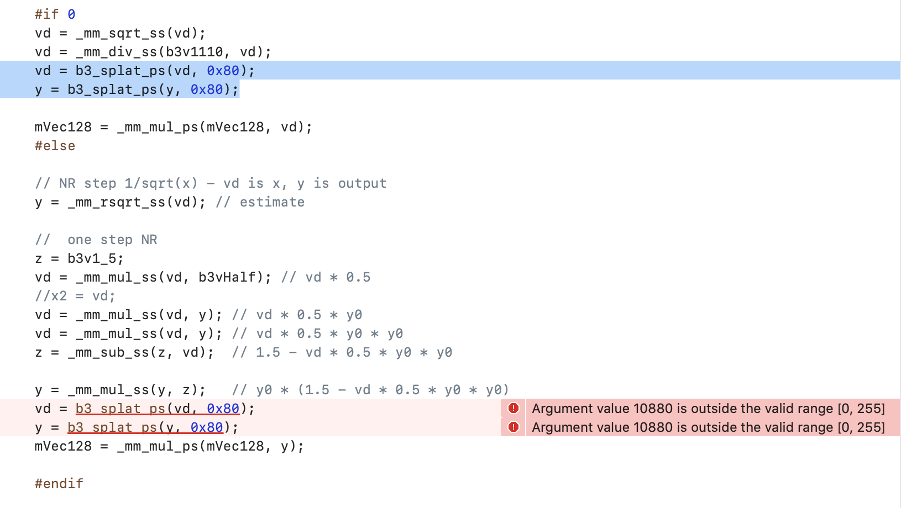
<dl>
	<dt>[2020/05/13 13:55] TA</dt>
	<dd>そのエラーってbtVector3.hで出てますか？</dd>
</dl>
<dl>
	<dt>​[2020/05/13 13:56] 質問者</dt>
	<dd>はい</dd>
</dl>
<dl>
	<dt>​[2020/05/13 14:01] TA</dt>
	<dd>今回のsphereのプログラムに関しては，bulletを解凍したフォルダ内にあるsrcフォルダの中身を，自身のプロジェクトのshared/inc内に上書きコピーしてみたら動くと思います．</dd>
</dl>
<dl>
	<dt>[2020/05/13 14:01] 質問者</dt>
	<dd>以下のページに書かれている回答によって解決しました！<br />
	どうやらappleがclangをupdateした際に発生したものらしいです<br />
	[https://www.gitmemory.com/issue/bulletphysics/bullet3/2114/478287490](https://www.gitmemory.com/issue/bulletphysics/ullet3/2114/478287490)</dd>
</dl>
<dl>
	<dt>[2020/05/15 12:35] TA</dt>
	<dd>この問題についてですが，Bulletの最新verのv2.89ではこの問題は解消されていたので，最新版のBulletを使えば大丈夫そうです.
(ちなみに，質問者が挙げてくれたサイトの回答と全く同じ記述がコード内にあったので，既に解決済みの方はそのままで問題ないです)</dd>
<dl>

## [mac] mac環境でサンプルプログラムの日本語コメントが文字化けする
mac環境でサンプルプログラムを開くとコメント(日本語の箇所と思われるところ)が文字化けしてしまうのですが、他のmacの方どうですか
<dl>
	<dt>[2020/05/13 14:07] TA</dt>
	<dd>配布されているソースコードはShift-JISで書かれているので，UTF-8に変換してみてください．</dd>
</dl>


## VS2017で"～が開けません"というエラーが大量に出る
サンプルファイルを解凍してプロジェクトを開くと画像のようなエラーが出てしまい実行できません
～を開けません系のエラーが500くらい出てしまいます。なにか設定を間違えたでしょうか
環境はVS2017です
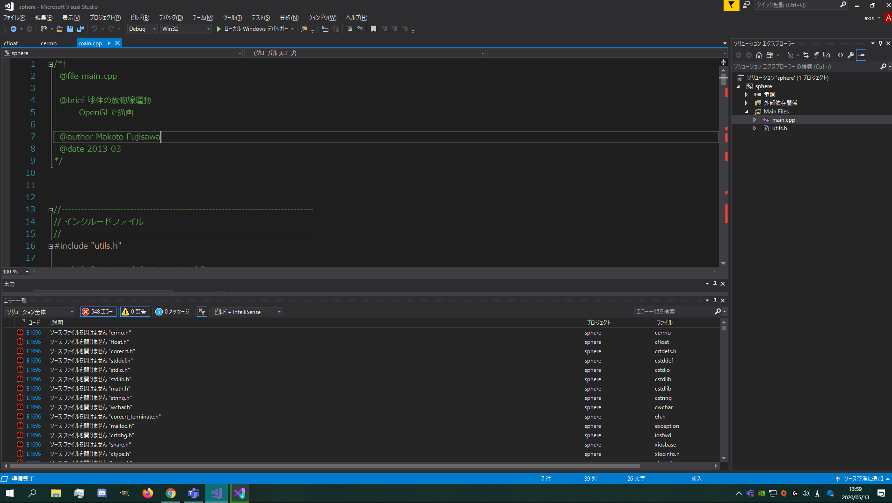
<dl>
	<dt>[2020/05/13 14:21] TA</dt>
	<dd>うーん，状況がわからないのでちょっとなんともいえないですが，解凍してそのままビルドしたらそのエラーが出た感じですか？</dd>
</dl>
<dl>
	<dt>[2020/05/13 14:22] 質問者</dt>
	<dd>解凍してプロジェクトを開き、main.cppを開いた時点でこのエラーが出ます。<br />
	いままで自分で使っていたVS2017がなにかいけないのかと思ったのでとりあえず2019を入れて試してみます</dd>
</dl>
<dl>
	<dt>[2020/05/13 14:29] 藤澤誠</dt>
	<dd>VS2017のままでOKです．おそらくWindowsSDKのバージョン違いだと思います(VS2017の中でもインストールした時期などで微妙に違うんです...)．</dd>
</dl>
<dl>
	<dt>[2020/05/13 14:30] 藤澤誠</dt>
	<dd>プロジェクト(右バーの「sphere」)を右クリックして，プロジェクトの再ターゲットを選んでください．井上君の環境でのWindowsSDKのバージョンが表示されると思うので，そのままOKでプロジェクトが再設定されます．</dd>
</dl>
<dl>
	<dt>[2020/05/13 14:31] 質問者</dt>
	<dd>ありがとうございます。やってみます</dd>
</dl>
<dl>
	<dt>[2020/05/13 14:37] 質問者</dt>
	<dd>治りました！</dd>
</dl>


## quaternionの式におけるθはradianですか?
quaternionの式におけるθはradianですか？
<dl>
	<dt>[2020/05/15 17:22] 藤澤誠</dt>
	<dd>radianです．degreeでもいいけどC/C++のsin,cos関数はradianなので．​</dd>
</dl>
<dl>
	<dt>[2020/05/15 17:23] 質問者</dt>
	<dd>あ、確かに定義式としてはどちらにしても同じですね...。ありがとうございます。</dd>
</dl>
<dl>
	<dt>​[2020/05/15 17:27] 藤澤誠</dt>
	<dd>ちなみに物理エンジンbulletもradianを基本にしているので，radianで全部考えておくと実装するときに間違いがないです(一応，bulletにはbtRadiansという変換用関数があるけど)．定義としてはその通りどちらでもよいけど．</dd>
</dl>


## VS2019で "RuntimeLibrary" の不一致が検出されました とエラーが出る
VS2019で第2回のInitBulletを定義すると次のようなエラーが何行か出てしまいます。追加のライブラリディレクトリにshared/libは追加してありますが治らないです。
```
BulletCollision.lib(btCollisionDispatcher.obj) : error LNK2038: 'RuntimeLibrary' の不一致が検出されました。値 'MTd_StaticDebug' が MDd_DynamicDebug の値 'main.obj' と一致しません。
```
<dl>
	<dt>[2020/05/15 17:41] 藤澤誠</dt>
	<dd>すこし待っていてください．こっちで確認します．このエラーが出るのはビルド設定でlibファイルとプロジェクトのstatic/sharedリンクの設定が異なっている時におきます．bullet2.89のデフォルト設定を確認しておきます．</dd>
</dl>
<dl>
	<dt>​[2020/05/15 17:46] 藤澤誠</dt>
	<dd>VS2019でプロジェクト(sphere)を右クリックして，プロパティを開いてみてください．その中の，C/C++→コード生成 の ランタイムライブラリ の欄はどうなっていますか？bulletのデフォルトは マルチスレッド デバッグ もしくは マルチスレッド だと思いますが，これの後ろにDLLとかついてないですか？</dd>
</dl>
<dl>
	<dt>​[2020/05/15 17:48] 質問者</dt>
	<dd>マルチスレッド デバッグ DLL (/MDd)と書いてありました。</dd>
</dl>
<dl>
	<dt>​[2020/05/15 17:48] 藤澤誠</dt>
	<dd>すいません，今確認したらsphereのデフォルトがマルチスレッド DLLになってました... 上記の設定でそこをマルチスレッド デバッグ (/MTd)に変更してください．</dd>
</dl>
<dl>
	<dt>​[2020/05/15 17:50] 質問者</dt>
	<dd>ありがとうございます解決しました！</dd>
</dl>


## [mac] xcodeでのlibファイル生成場所？
libファイルをこぴーするとありますが、xcodeでbuildした場合はどこに生成されるんでしょうか？見つけられず...
<dl>
	<dt>[2020/05/22 16:32] 藤澤誠</dt>
	<dd>macだと*.libではなく*.aというファイルが生成されていると思います(libBulletDynamics.aとか)．</dd>
</dl>
<dl>
	<dt>​[2020/05/22 16:32] TA</dt>
	<dd>例えば、LinearMathのlibファイルであればbulidしたフォルダ内のsrc/LinearMath/&quot;Debug&quot;or&quot;Release&quot;/libLinearMath.aです</dd>
</dl>
<dl>
	<dt>[2020/05/22 16:33] 質問者</dt>
	<dd>見つかりました、ありがとうございます</dd>
</dl>


## [mac] shared\incへコピーするファイルについて
BULLET\srcフォルダの中身をそのまま，
```
shared\inc
```
にコピーするとありますが、build先のフォルダ内のsrcフォルダの中身ですか？mac,xcodeで作業しています
<dl>
	<dt>[2020/05/22 16:57] 藤澤誠</dt>
	<dd>そうです．Bulletを解凍したフォルダ内のsrcフォルダです．xcodeのプロジェクトでshared/incをインクルードフォルダに設定してあるならばそこでOKです．</dd>
</dl>
<dl>
	<dt>​[2020/05/22 16:58] 質問者</dt>
	<dd>わかりました、ありがとうございます</dd>
</dl>


## VS2017で include ファイルを開けません。 などのエラーが多発する
VS2017を使っています。bullet2.87をダウンロードして、説明ページの通り実行してビルドすると
```
include ファイルを開けません。'corecrt.h':No such file or directory (ソース ファイルをコンパイルしています ..\..\examples\Importers\ImportObjDemo\LoadMeshFromObj.cpp)    App_RobotSimulator    c:\program files (x86)\microsoft visual studio\2017\community\vc\tools\msvc\14.16.27023\include\crtdefs.h    10   
エラー    D8040    子プロセスの作成中または更新中にエラーが発生しました。    BussIK    C:\Users\\デスクトップ\2020春学期\実験A\A\bullet3-2.87\bullet3-2.87\build3\vs2010\cl    1  
```
などのエラーが多数出てしまいビルドできません。（DebugでもReleaseでも同じでした）
今回はWindowsSDKは8.1にしています。
どのようにしたら良いでしょうか
<dl>
	<dt>[2020/05/22 17:06] 藤澤誠</dt>
	<dd>binフォルダ内にBulletDynamics.libやLinearMath.libなどはできていますか？いくつかのプロジェクトは環境によってはエラーが出るみたいですが，実験で使うのは<span style="font-size:14.4px;">BulletCollision, BulletDynamics, LinearMath, BulletSoftBodyの各libファイルだけなのでそれらが生成できていればそれ以外のプロジェクトのエラーは無視できます．</dd>
</dl>
<dl>
	<dt>​[2020/05/22 17:07] 質問者</dt>
	<dd>すみません、何も生成されず空になっています</dd>
</dl>
<dl>
	<dt>​[2020/05/22 17:09] 藤澤誠</dt>
	<dd>それでは一度ファイルを削除して，解凍し直して，WindowsSDKのバージョンを選ぶところを8.1ではなく10.* (*のところは環境によって違う)でやってみてくれませんか？Community版だと8.1でうまくいかない可能性もあるので．<br />
	(こっちの環境(VS2017Pro)で10.*でやってみたところ，10個ぐらいのプロジェクトはエラーをはきましたが，上記の必要なlibのプロジェクトはビルドに成功するようなので)</dd>
</dl>
<dl>
	<dt>​[2020/05/22 17:11] 質問者</dt>
	<dd>分かりました</dd>
</dl>
<dl>
	<dt>[2020/05/22 17:20] 質問者</dt>
	<dd>binファイルに生成されました、ありがとうございます。（エラーは出たままでした）</dd>
</dl>
<dl>
	<dt>[2020/05/22 17:22] 藤澤誠</dt>
	<dd>よかったです．エラーが出たのは今回は無視しましょう(テスト用のプロジェクトが多過ぎなんですよね...)．</dd>
</dl>


## btQuaternionのメンバーではありませんというエラーが出る
main.cppの冒頭に#pragma ~　を記述するところまで行ったのですが、途中で以下のようなエラー出ていることに気づいたのですが、これはどうすればよいのでしょうか。
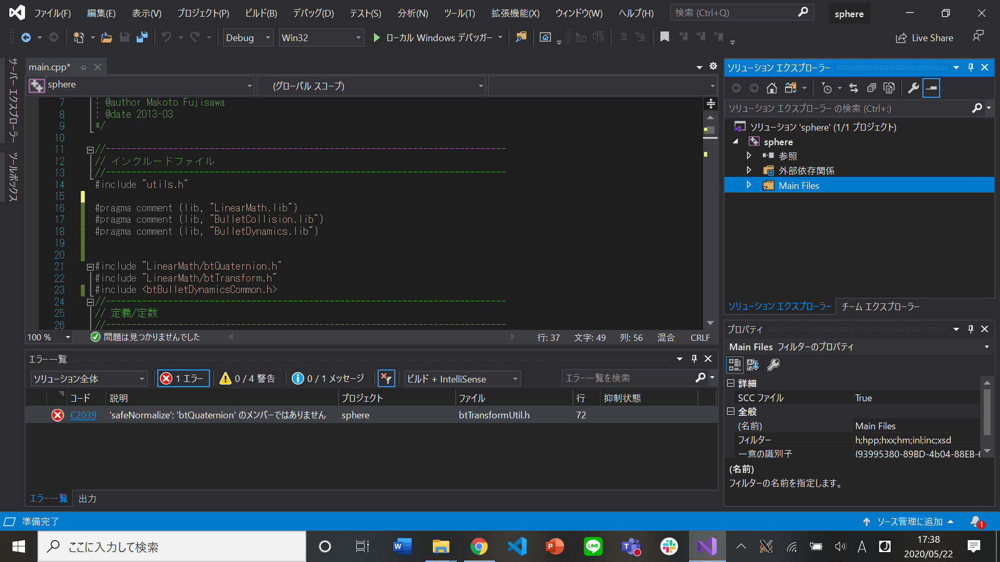
<dl>
	<dt>[2020/05/22 17:48] 藤澤誠</dt>
	<dd>インクルードの順番かな．
	<pre style="font-size:14.4px;">
#include &lt;btBulletDynamicsCommon.h&gt;</pre>
	の前にbtQuaternion.hとbtTransform.hをインクルードしているけど，それらをbtBulletDynamicsCommon.hの下に持ってくるか，単純に削除して見てください．</dd>
<dl>
	<dt>[2020/05/22 17:51] 質問者</dt>
	<dd>治りました。ありがとうございます。</dd>
</dl>


## [mac] ld: library not found for -lBulletDynamics というエラーが出る
xcodeで練習問題１を実行しようとしたときに以下のようなエラーが出ました
```
ld: library not found for -lBulletDynamics
clang: error: linker command failed with exit code 1 (use -v to see invocation)
```
libBulletDynamics.aやその他*.aファイルはFrameworksに追加しているのでなぜこのエラーが出るかわからないです。どのようにしたら良いでしょうか。
<dl>
	<dt>[2020/05/22 18:23] TA</dt>
	<dd>Build SettingsでLibrary Search Pathsを指定してないとかかもしれません．<br />
	ちなみにlib_macフォルダには使うlibファイルをまとめて入れておくとよいです．</dd>

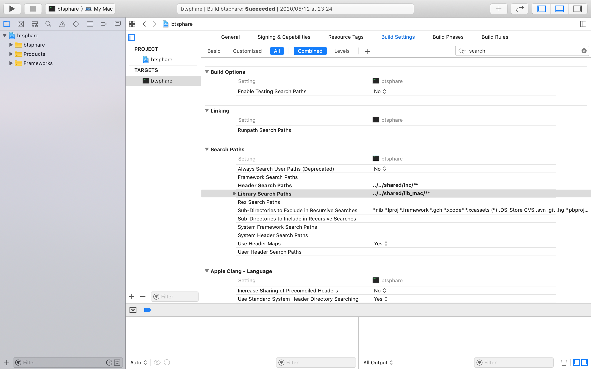

</dl>
<dl>
	<dt>​[2020/05/22 18:38] 質問者</dt>
	<dd>
	うまく行きました。ありがとうございます！</dd>
</dl>


## [mac] xcodeでThread 1: signal SIGABRTというエラーが出る
btcubeについて、build succeededとは出るのですが、ソースコードではない部分(実行ファイル？)に
```
Thread 1: signal SIGABRT
```
が出て原因がわかりません。調べてもよくわからないです、、
<dl>
	<dt>[2020/06/03 14:36] 質問者</dt>
	<dd>あ、今解決しました。<br />
	frameworksにあった余分なものを消したら動きました。</dd>
</dl>


## 関数InitBulletを定義するだけでエラーがたくさん出てくる
関数InitBulletを定義するだけでエラーがたくさん出てきてビルドできないのですが、これは正常なのでしょうか。main関数の中などで呼び出しているわけではありません。

<dl>
	<dt>[2020/05/22 19:11] 藤澤誠</dt>
	<dd>Visual Studioでプロジェクト(sphere)を右クリックして，プロパティを開いてみてください．その中の，C/C++→コード生成 の ランタイムライブラリ の欄が&quot;マルチスレッド デバッグ DLL&quot;となっていたら&quot;マルチスレッド デバッグ&quot;に変更してみてください(すいません，サンプルプログラムの設定ミスのようです)．</dd>
</dl>
<dl>
	<dt>[2020/05/22 19:15] 質問者</dt>
	<dd>マルチスレッドデバッグに直してみたのですが、変わらないです...</dd>
</dl>
<dl>
	<dt>[2020/05/22 19:18] 質問者</dt>
	<dd>vsの再起動などもしてみましたが、エラーの数は変わってないみたいです。</dd>
</dl>
<dl>
	<dt>[2020/05/22 19:18] 藤澤誠</dt>
	<dd>あとは，ReleaseでビルドしたlibファイルをDebugモードで参照してないでしょうか？Bulletのビルドで最後にReleaseとDebugどちらでビルドしましたか？</dd>
</dl>
<dl>
	<dt>[2020/05/22 19:20] 質問者</dt>
	<dd>先にdebugでやったので最後にreleaseをしたと思います。</dd>
</dl>
<dl>
	<dt>[2020/05/22 19:21] 藤澤誠</dt>
	<dd>そうするとshared/libフォルダにはReleaseで作ったlibファイルが入っているので，sphereのプログラムの方をReleaseにしてみてください(上のランタイムライブラリはReleaseの場合は&quot;マルチスレッド&quot;になります)．</dd>
</dl>
<dl>
	<dt>[2020/05/22 19:25] 質問者</dt>
	<dd>できました。ありがとうございます。これからずっとreleaseモードでビルドしていかないとエラーが出てしまうということですか？debugモードに直した方ががよいのでしょうか。</dd>
</dl>
<dl>
	<dt>[2020/05/22 19:30] 藤澤誠</dt>
	<dd>両方使えるとそれがいいのですがとりあえずはReleaseでもだいじょうぶです．ただ，Releaseだとデバッガが使えないので，時間のあるときにDebugでもBulletを再度ビルドしてみてください(Releaseはその代わりに最適化してくれるので実行速度が速い)．ただし，Bulletはdebugとreleaseでlibファイル名を変えないので再度ビルドすると今度はDebug版でRelease版が上書きされてしまします(今はdebug-&gt;releaseの順番でビルドしたのでdebug版のlibが上書きされてしまった状態)．そのため，binフォルダの中身を丸ごとどっかにコピーしておいてから行うことをおすすめします．</dd>
</dl>
<dl>
	<dt>[2020/05/22 19:32] 質問者</dt>
	<dd>わかりました。ありがとうございます。</dd>
</dl>
<dl>
	<dt>[2020/05/22 19:32] 藤澤誠</dt>
	<dd>なお，両方使う場合は，上でも確認してもらったプロジェクトのプロパティの リンカー→全般→追加のライブラリディレクトリ の設定をReleaseとDebugで変えると良いです(プロパティウィンドウの左上でRelese,Debug選べます)．</dd>
</dl>
<dl>
	<dt>[2020/05/22 19:35] 質問者</dt>
	<dd>承知しました。</dd>
</dl>


## [mac] xcodeで Undefined symbols for architecture というエラーが出る
xcodeにてbuildをした際、以上のようなerrorが出ます。関数がないということだと思うのですが、それがどこにあるのかもわかりません

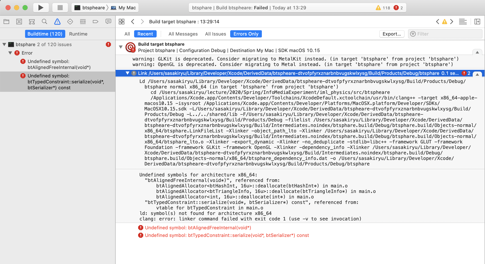

lib, srcは次の通り、不足はないはずです

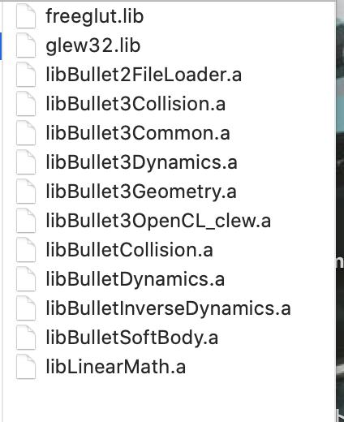

 
定義もされているように見えます

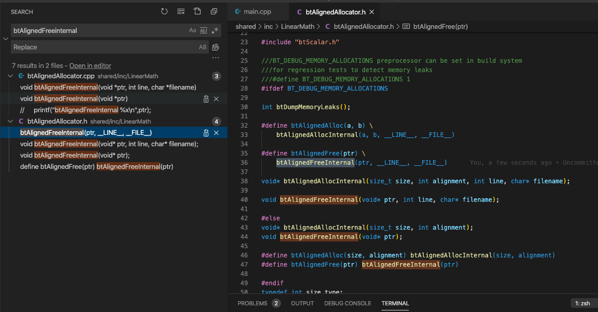

<dl>
	<dt>[2020/05/27 13:51] 藤澤誠</dt>
	<dd>btsphereをビルドしようとしている段階ですね．定義に関してはヘッダーファイル内でのdefineは単純に関数名の変換用なので，関数の中身自体はlibLinearMath.aにあります．それがうまくリンクされていないようですね．</dd>
</dl>
<dl>
	<dt>​[2020/05/27 13:53] 藤澤誠</dt>
	<dd>少し調べてみたところ
	[【Xcode】ライブラリの追加方法 | AdMax Tech Blog](http://tech.admax.ninja/2014/09/12/add-library-in-xcode-project/)
	の方法でxcodeのプロジェクトでリンクされているライブラリを確認できそうなので，調べてみてくれませんか．</dd>
</dl>
<dl>
	<dt>[2020/05/27 14:00] 質問者</dt>
	<dd>こうなっておりました。ここに.aファイルを追加したらコンパイル成功しました。
	library search pathにlibへのパスを書いていれば良いと勘違いしておりました。
	</dd>

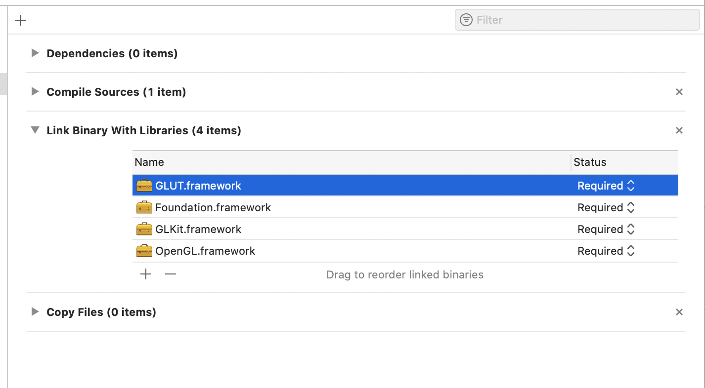

</dl>


## [mac] freeglut関係のインクルードでエラーが出る
```
/shared/inc/GL/freeglut_ext.h:168:27: Functions that differ only in their return type cannot be overload
```
というエラーが出ました。返り値が違うだけの関数はオーバーロードできないということですが、かといって関数名をかえたら他のところが動かなくなりそうでどうしたら良いかわかりません。どうしたら良いでしょうか...？
 
該当の箇所です
```
/*
 * Extension functions, see freeglut_ext.c
 */
typedef void (*GLUTproc)();
FGAPI GLUTproc FGAPIENTRY glutGetProcAddress( const< char *procName );
```

もう一つの宣言はglut.hにあるようです。555行目です
```
#if (GLUT_API_VERSION &gt;= 5)
extern void * APIENTRY glutGetProcAddress(const char *procName) OPENGL_DEPRECATED(10_3, 10_9);
#endif
```

<dl>
	<dt>[2020/05/29 19:29] 質問者</dt>
	<dd>stackoverflowはありましたが解決策はない感じです</dd>

[Error: functions that differ only in their return type cannot be overloaded](https://stackoverflow.com/questions/20024008/error-functions-that-differ-only-in-their-return-type-cannot-be-overloaded)

</dl>
<dl>
	<dt>[2020/05/29 19:48] 藤澤誠</dt>
	<dd>xcodeでGLUT Frameworkを使っているならば，freeglutは使う必要ないので，shared/inc/GLは無視でOKです．<br />
	#include &lt;GL/glut.h&gt;<br />
	を消して，<br />
	#include &lt;GLUT/GLUT.h&gt;<br />
	に置き換えてみてください．</dd>
</dl>
<dl>
	<dt>[2020/05/29 20:02] 藤澤誠</dt>
	<dd>あと，glutCloseFuncもそんな関数ないと言われるかもしれません，その場合は glutWMCloseFuncに置き換えてみてください．</dd>
</dl>
<dl>
	<dt>[2020/05/30 15:33] TA</dt>
	<dd>utils.hとrx_shadow_gl.hの両方に<br />
	#include &lt;GL/glut.h&gt;<br />
	があるので注意してください。</dd>
</dl>
<dl>
	<dt>[2020/05/30 15:52] TA</dt>
	<dd>また、GLEWのlibファイルが必要になるので、brewなどでインストールしてみてください。<br />
	libファイルの設定の仕方などは以下のサイトが参考になると思います。</dd>
</dl>

[Setup Modern OpenGL 4.1 on macOS (Xcode, GLFW and GLEW)](https://riptutorial.com/ja/opengl/example/21105/macos%E4%B8%8A%E3%81%AE%E6%9C%80%E6%96%B0%E3%81%AEopengl-4-1%E3%82%92%E3%82%BB%E3%83%83%E3%83%88%E3%82%A2%E3%83%83%E3%83%97%E3%81%99%E3%82%8B-xcode-glfw-%E3%81%8A%E3%82%88%E3%81%B3glew-)

<dl>
	<dt>[2020/06/03 5:50] 質問者</dt>
	<dd>返信が遅くなり申し訳ありません。無事コンパイルできました！ありがとうございます...！！</dd>
</dl>


## 衝突検出の練習問題４で衝突検出結果がおかしい
衝突検出の練習問題４で特定のキーを押したときにグローバル変数g_pMoveBodyにCreateRigidBody(0.0, trans, box_shape, 0)を格納し、 左右キー押されたとき(下のコードは右だけ)に
```
if(g_pMoveBody){​​​​
​     btTransform new_trans;
    g_pMoveBody-&gt;getMotionState()-&gt;getWorldTransform(new_trans);
    new_trans.getOrigin() += btVector3(0.02, 0.0, 0.0);
    g_pMoveBody-&gt;getMotionState()-&gt;setWorldTransform(new_trans);
}​​​​​
```
を記述したのですが、左右キーで動くのは物体の形だけで実際には最初の位置にずっと透明の立方体があるようになってしまいます。 また、左右キで動かした物体は他の物体がすり抜けてしまいます。 なぜこうなるのか考えても理由がわからず質問しました。​

こんな感じです。
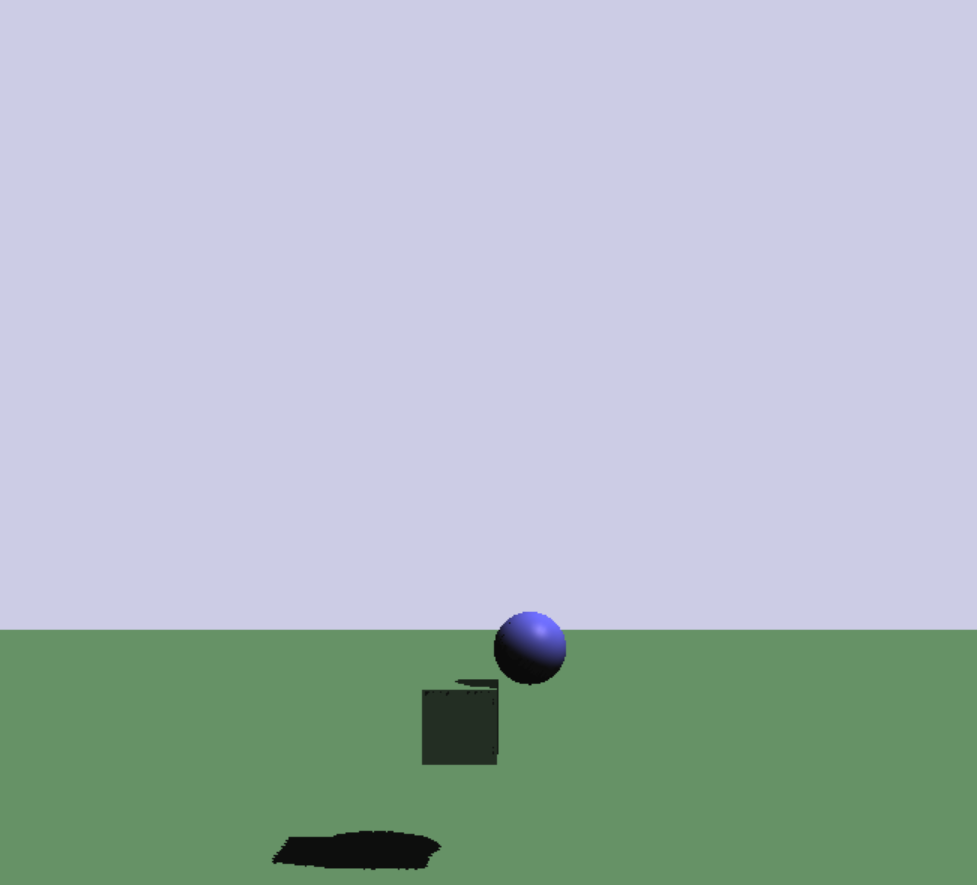

<dl>
	<dt>[2020/06/05 15:53] 藤澤誠</dt>
	<dd>確認なのですが，「グローバル変数g_pMoveBodyにCreateRigidBody(0.0, trans, box_shape, 0)を格納」は特定のキーを押したときとありますが，SetRigidBodies関数内で行っているわけではないということですか？(つまり最初の状態では緑のboxはなくて，キーを押すと緑のboxが出てくるような状態)</dd>
</dl>
<dl>
	<dt>[2020/06/05 15:55] 質問者</dt>
	<dd>SetRigidBodiesの関数内で格納してます。特定のキーを押した時に用意しておいたグローバル変数の値を変更し、その後SetRigidBodies内でif文を使って、g_pMoveBody=CreateRigidBody(0.0, trans, box_shape, 0)を実行しています。<br />
	<blockquote> つまり最初の状態では緑のboxはなくて，キーを押すと緑のboxが出てくるような状態←この状態です。</blockquote>
	</dd>
</dl>

<dl>
	<dt>[2020/06/05 16:30] 藤澤誠</dt>
	<dd>g_pMoveBody=CreateRigidBody(0.0, trans, box_shape, 0)の下に，<br />
	<blockquote>
	g_pMoveBody-&gt;setCollisionFlags(g_pMoveBody-&gt;getCollisionFlags() | btCollisionObject::CF_KINEMATIC_OBJECT);
	</blockquote>
	を追加して試してみてもらえませんか．こちらではそれで解決しました．</dd>
</dl>
<dl>
	<dt>​[2020/06/05 16:32] 質問者</dt>
	<dd>上手く実行できました。ありがとうございます</dd>
</dl>


## 衝突フィルタリングについて
衝突フィルタリングについて
```
world-&gt;addRigidBody(body1, RX_COL_GROUP1, RX_COL_GROUND);
world-&gt;addRigidBody(body2, RX_COL_GROUP2, RX_COL_GROUND | RX_COL_GROUP1 | RX_COL_GROUP2);
```
といったように, group2にはgroup1と衝突する。と指定し、group1ではgroup2と衝突しない。と指定した場合、これら二つは衝突しない、という認識で正しいでしょうか？
<dl>
	<dt>[2020/06/10 13:03] 藤澤誠</dt>
	<dd>はい，そうです．group1と2を衝突させる場合は，body1,body2にそれぞれRX_COL_GROUP2,RX_COL_GROUP1を指定する必要があります(片一方だけでは×)．</dd>
</dl>
<dl>
	<dt>[2020/06/10 13:15] 質問者</dt>
	<dd>であれば、各オブジェクトごとにぶつかる対象のグループを設定するではなく、
	各グループごとに衝突するグループを設定し、各オブジェクトに対してはそれがどのグループに属するかのみを与えたほうが設定漏れなどのミスがなくて良いのではないかと思うのですが、そういったことはできるのでしょうか</dd>
</dl>
<dl>
	<dt>​[2020/06/10 13:22] 藤澤誠</dt>
	<dd>もしかしたらあるかもしれないですが，私の知る限りではbulletでグループの衝突を個別に設定できる機能はないですね．基本的にはbtRigidBodyごとに設定する必要がありそうです．<br />
	グループとグループに属するオブジェクト，グループ間の衝突フィルタなどをまとめて管理するクラスなどを自分で作るのが解決策かな．
	後は，Custom NearCallBackという衝突時の処理を自分でカスタマイズできる機能もあるのでそれを使って衝突時のフィルタ処理を自分で書くという手もあります(Bullet User Manualの7.Collision Filteringの&quot;Filtering Collisions Using a Custom NearCallback&quot;参照)．</dd>
</dl>
<dl>
	<dt>​[2020/06/10 13:28] 質問者</dt>
	<dd>ありがとうございます。管理クラスのほうが実装は難しくなさそうですね。</dd>
</dl>


## [mac] ライブラリのリンクが一定時間で切れたり、プロジェクト起動時に再設定しなければならない
質問ではないですが、ライブラリのリンクが一定時間で切れたり、プロジェクト起動時に再設定しなければならなかった問題について。
リンクしていたライブラリがicloud上に保存されていたものであったのが原因なようです。一度自身のPCにダウンロードすることで解決できたと思われます。icloudとデスクトップが同期されているのですが、今回は生成されたライブラリファイルをicloud上のみに保存してしまってました。


## ＆演算子について
練習問題６の描画する位置をDisplay関数内に変えたいのですが、&amp;演算子についてあんまり理解しておらず、グローバル変数を定義しようとしてもエラーが解決できずにいます。どのような感じの定義をしたらいいのでしょうか。

<dl>
	<dt>[2020/06/10 14:51] 藤澤誠</dt>
	<dd>変数定義時の＆演算子は参照変数を表しています．例えば，<br />
	int a = 10;<br />
	int &amp;b = a;<br />
	と定義した後に，bの値を変更すると，変数aの中も変更されます(bはaの参照になっている)．練習問題6のサンプルコード内で&amp;を使っているのは単に余計なメモリを食わないようにしているだけなので，グローバル変数で定義する場合は特に必要ないかと思います．<br />
	あと，スクリーンショットで示したg_ptAは何を格納したいのでしょうか？衝突点座標を格納したいのならば配列にすべきなので，例えば可変長配列vectorを使って，<br />
	vector&lt;btVector3&gt; g_pts;<br />
	とグローバルで定義しておいて，衝突点をg_pts.push_back(ptA);とかで格納していくという方法もあります．<br />
	ちなみにvectorについては実験ページのC++の教材のところにある</dd>

[データ構造と標準テンプレートライブラリ(STL)](http://slis.tsukuba.ac.jp/~fujisawa.makoto.fu/lecture/iml/cpp/stl.pdf)

</dl>
<dl>
	<dd>というPDFが使い方の参考になると思います．</dd>
</dl>
<dl>
	<dt>[2020/06/10 15:10] 質問者</dt>
	<dd>ポインタはアドレスから値を取り出す感じなので、実体を宣言してからそこのアドレスを取り出すのは厳しいですが、それを可能にするのが＆(アドレスを取り出すというよりもアドレスを見ているというイメージではあるが)といった感じですかね。<br />
	後g_ptAについて、forで全パターン見ているのを考えてなかったです。確かに配列にすべきでした。</dd>
</dl>
<dl>
	<dt>[2020/06/10 15:23] 藤澤誠</dt>
	<dd>アドレスを見ているというイメージで合ってますね．ただ，あまり深く考えずにポインタだと*b=12とかのように*をつけて値にアクセスしなければならないけど，参照変数なら普通の変数のようにb=12と扱えるので便利という程度に考えておくと良いかと思います(参照引数と同じ)．</dd>
</dl>
<dl>
	<dt>[2020/06/10 15:27] 質問者</dt>
	<dd>わかりました。ありがとうございます。</dd>
</dl>


## 「４．剛体間リンク」の練習問題2でforce1の初期値が大きい？
練習問題２についてです。force1の値を出力しているのですが、一番最初の値がかなり大きくなってしまい、最初の段階でconstraintがはずれてしまいます。練習問題２に書いてある通りにコードは書いています。
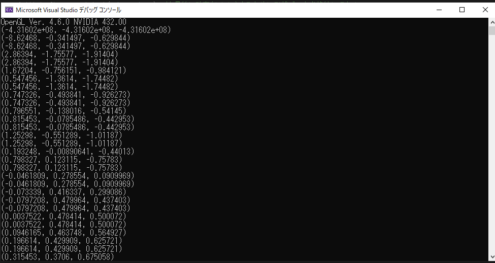
<dl>
	<dt>[2020/06/12 17:31] 藤澤誠</dt>
	<dd>何らかの設定か環境によってそうなることがあるようです．私の環境でもたまにこの現象が起きます(実はさっきの講義中のデモでも1回ありました)．この現象を確実になくすならば，</dd>
</dl>

```
	if(g_pConstraint){​​​
	           static bool init = true;
	            if(init){​​​​​​​​​​
	               init = false;
	            }​​​​​​​​​​
	            else{​​​​​​​​​​​​​​​​​
	                // ここにconstraintにかかる力のチェックのコードを記述
	            }​​​​​​​​​​​​​​​​​
	}​​​​​​​​​​​​​​​​​
```

<dl>
	<dd>と言ったように最初の1回だけスキップする用のコードを入れると良さそうです．</dd>
</dl>


## Hinge2 Constraintの変数の形式が違うというエラーが出る
Hinge2 Constraintの初期化をしようとした際に、サジェストされている通りに変数を与えても形式が違うと言われてします。
どこを間違っているのか見ていただきたいです


<dl>
	<dt>[2020/06/17 14:44] 藤澤誠</dt>
	<dd>後ろの3つの引数は btVector3 &amp;anchor, btVector3 &amp;axis1 btVector3 &amp;axis2 と参照引数になっています．そのため，定数ではなく中身を変更できる変数でないとだめです．変数anchor,axis2,axis3の宣言時のconstを取る必要ありです．</dd>
</dl>
<dl>
	<dt>[2020/06/17 14:47] 質問者</dt>
	<dd>ありがとうございます！</dd>
</dl>
<dl>
	<dt>[2020/06/17 14:50] 藤澤誠</dt>
	<dd>ついでに今手元で確認してみたのですが，2つのaxisについてはベクトルが正規化されていなかったら，正規化されて返されるようです(axis2のところに(1,0,1)を与えたら(0.7071, 0, 0.7071)と変更されて返ってきました)．その変数を別のところで使うときには注意が必要かもしれません．
	&nbsp;</dd>
</dl>


## Hinge Constraintの軸設定
Hinge Constraintをかけていれば一方向にしか回転しないと思うのですが、動かしていると車のボディに対するタイヤの向きが変わってしまいます。これは軸の設定が誤っているのでしょうか
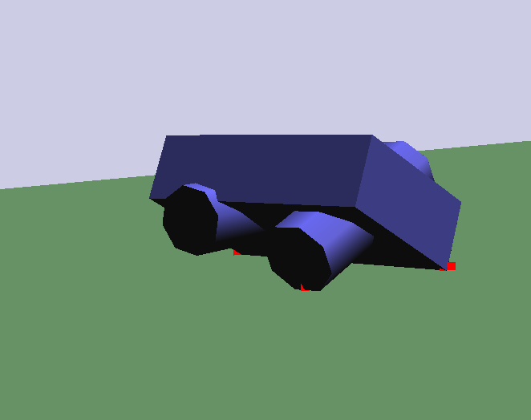
コードは以下のようになっております
```
    const btVector3 pivotInBody1 = btVector3(0, -BODY[1]/3, BODY[2]/2);
    const btVector3 pivotInBody2 = btVector3(0, -BODY[1]/3, -BODY[2]/2);
    const btVector3 pivotInWheel = btVector3(0, 0, 0);
    btVector3 axis1 = btVector3(0, 0, 0);
    btVector3 axis2 = btVector3(1, 0, 0);
    g_pJoint1 = new btHingeConstraint(*body, *rear_wheel, pivotInBody1, pivotInWheel, axis1, axis2);
    btHingeConstraint *joint2 = new btHingeConstraint(*body, *front_wheel, pivotInBody2, pivotInWheel, axis1, axis2);
```
axis1を(1,0,0）としたら外れなくなりました。
<dl>
	<dt>[2020/06/19 16:11] 藤澤誠</dt>
	<dd>タイヤはbtCylinderShapeとbtCylinderShapeXどちらを使っていますか？どちらにしてもpivotのx座標値とaxis1がおかしくないでしょうか？axis1が(0,0,0)では軸にならないのと，pivotInWheelの(0,0,0)もrigidbodyの中心で車のボディに接続することになってしまいます．</dd>
</dl>
<dl>
	<dt>[2020/06/19 16:13] 質問者</dt>
	<dd>btCylinderShapeXを使っております。
	ご指摘の通りaxis1をきちんと設定したら起きなくなりました。
	またpivotInWheelについては、タイヤを2つと勘違いしておりました。</dd>
</dl>
<dl>
	<dt>​[2020/06/19 16:20] 質問者</dt>
	<dd>「pivotInWheelについては、タイヤを2つと勘違いしておりました。」って横に細長いタイヤ2つをボディにめり込ませていたのか(理解するのに少し時間がかかりました...)．それでpivotのx座標が0なのか．それはそれでありですね(ロードローラーのようなイメージですね)．問題の意図としては4つのタイヤだったのですが，質問者の案でも良さそうです．<br />
	↑もちろんCollision Filteringをちゃんと設定していることが前提ですが．</dd>
</dl>
<dl>
	<dt>​[2020/06/19 16:24] 質問者</dt>
	<dd>そうです、細長い円柱を一つのタイヤとしていました。言葉足らずでした、すみません。
	わかりました。ありがとうございます！</dd>
</dl>


## 種類の違う複数のConstraintを一括で扱える型はあるのか？
破棄のためにConstraintをグローバル変数として格納することについて質問です。
Constraintを配列に格納したいのですが、btHingeConstraint, btHinge2Constraint, btTypedConstraintとそれぞれ型が異なります。
これらを一括で扱える型はあるのでしょうか？型ごとに配列を用意しなければなりませんか？
```
btConstraintArray *g_pConstraints;
```
を用いようとしたのですが、
```
Reference to type 'const btSolverConstraint' could not bind to an lvalue of type 'btHingeConstraint *'
```
とエラーが出てしまいました
<dl>
	<dt>[2020/06/19 16:42] 藤澤誠</dt>
	<dd>btTypedConstraint型ならすべてのConstraintを格納できるはずです．なのでvector&lt;btTypedConstraint*&gt;とかにすればOKです．後は，こちらで格納しなくてもWorldにaddConstraintしてあるならば，</dd>
</dl>

```
	for(int i = g_pDynamicsWorld-&gt;getNumConstraints()-1; i&gt;=0 ;i--){​​​​​
		btTypedConstraint* constraint = g_pDynamicsWorld-&gt;getConstraint(i);
	    g_pDynamicsWorld-&gt;removeConstraint(constraint);
	 	delete constraint;
	}
```

<dl>​​​​​
	<dd>といったコードでWorldからConstraintを取り出して破棄することは可能です．</dd>
</dl>
<dl>
	<dt>​[2020/06/19 16:46] 質問者</dt>
	<dd>btTypedConstraintで良いのですね。ありがとうございます。
	今確認したら上記コードを実装しておりました、ワールドリセットの際にクラッシュしてしまったため破棄の処理ができていないものと思っていたのですが、別の部分が問題かもしれません。確認してみます。</dd>
</dl>


## objファイルはどこにおいたらいい？
bunny.objをDLしてmain.cppと同じフォルダに置いて、&quot;./bunny.obj&quot;の名前で3Dオブジェクトを読み込もうとすると、
```
rxOBJ::Read : Invalid file specified
```
と標準出力に出力されるのですが、これはパスの指定が間違っているのでしょうか。
３Dモデルのファイルはどこに置いたら良いでしょうか
<dl>
	<dt>[2020/06/24 13:58] 藤澤誠</dt>
	<dd>サンプルプログラムのデフォルトだとbinフォルダですね(sharedとかsrcと同じ階層のフォルダ)．binフォルダに置いた場合はファイル名のみでOKです．​</dd>
</dl>
<dl>
	<dt>[2020/06/24 13:59] 質問者</dt>
	<dd>できました！有難うございます</dd>
</dl>
<dl>
	<dt>[2020/06/24 13:59] 藤澤誠</dt>
	<dd>後は，絶対パスで指定するのも可能です．例えば &quot;C:/data/bunny.obj&quot; とか．この場合は，区切りをバックスラッシュ&quot;/&quot;にしておいてください．</dd>
</dl>


## RxModel::Readが上手く動かない？
3Dモデルの読み込みで、RxModel::Readが上手く動きません。 エラーはこんな感じです。

<dl>
	<dt>[2020/06/24 14:24] 藤澤誠</dt>
	<dd>対応する部分のコードを見せてもらうことは出来ますか？</dd>
</dl>
<dl>
	<dt>​[2020/06/24 14:24] 質問者</dt>
</dl>

```
	rxPolygons poly;
	RxModel::Read(&quot;bunny.obj&quot;, poly);
```

<dl>
	<dd>HPのコピペです。ファイル名だけ変えました。</dd>
</dl>
<dl>
	<dt>[2020/06/24 14:29] 藤澤誠</dt>
	<dd>うーん，ソースファイルごとアップロードしてもらっていいですか？こっちで検証してみます．</dd>
	<dd>↑main.cppだけでOKです．</dd>
</dl>
<dl>
	<dt>[2020/06/24 14:31] 質問者</dt>
	<dd>よろしくお願いします<br />
	[main.cpp]</dd>
</dl>
<dl>
	<dt>[2020/06/24 14:35] 藤澤誠</dt>
	<dd>上のコードですが，RxModel::Readとかを関数内でなくグローバル変数の定義のとこに書いちゃってますね．関数外で他の関数は呼べません．RxModel::Readのところは剛体とかを追加している関数内に書いてください．</dd>
</dl>
<dl>
	<dt>[2020/06/24 14:36] 質問者</dt>
	<dd>エラー治りました。ありがとうございます。</dd>
</dl>


## [mac] rx_model.hをインクルードするとエラーが出る
rx_model.hをインクルードすると以下のものと似たようなエラーが何箇所か出てしまい直し方がわからないです。
また.libファイルはxcodeで作業しているので.aファイルにするべきでしょうか


<dl>
	<dt>​[2020/06/24 14:14] 藤澤誠<dt>
	<dd>rx_model.hはrx_mesh.hというヘッダファイルを呼んでいるのですが，その中の関数の宣言と定義が違うというエラーっぽいですね．sharedフォルダ内のrx_mesh.hを開いて，エラーが出た関数の宣言(ReverseNormalsなら224行目あたり)にstaticを前につけてみてください(static void ReverseNormals(const ～) のように)．<br />
	ちなみにVisual Studioの場合は定義側だけにstaticを付けていても問題ないので，xcodeのコンパイラとの仕様の違いかと思います．後，.libファイルはxcodeの場合は.aファイルになります．</dd>
</dl>
<dl>
	<dt>[2020/06/24 14:21] 質問者</dt>
	<dd>エラーの件、staticをつけることで解決しました。ありがとうございます。</dd>
	<dt>[2020/06/24 14:26] 質問者</dt>
	<dd>.aファイルの作り方がいまいち分からないです。.libからは変換できないですよね</dd>
</dl>
<dl>
	<dt>[2020/06/24 14:28] 藤澤誠</dt>
	<dd>以前にBulletDynamics.aとかを作ったときにSoftBodyのも作られているはずなので改めて作る必要はないかと．</dd>
</dl>
<dl>
	<dt>​[2020/06/24 14:30] 質問者</dt>
	<dd>
	あ、今回のrx_model.libについてです</dd>
</dl>
<dl>
	<dt>[2020/06/24 14:32] 藤澤誠</dt>
	<dd>あー，そうだったrx_model.libもmacでビルドする必要があるのか．少々お待ちください．</dd>
</dl>
<dl>
	<dt>[2020/06/24 14:39] 質問者</dt>
	<dd>
	ありがとうございます</dd>
</dl>
<dl>
	<dt>[2020/06/24 16:05] TA</dt>
	<dd>一般チャンネルの方にlibrx_model.aをアップロードしたので，macユーザーの方は使ってみてください．</dd>
</dl>


## 未解決の外部シンボル "void _cdecl RxModel::Read(～"というエラーが出る
画像のようなエラーが出るのですが、解決方法がわからないです


<dl>
	<dt>[2020/06/26 15:39] 藤澤誠</dt>
	<dd>ライブラリファイル rx_model.libはリンクしてありますか？</dd>
</dl>
<dl>
	<dt>[2020/06/26 15:46] 質問者</dt>
	<dd>うまくリンクされていなかったみたいです。ifdefの方を書いたらうまくいきました。ありがとうございます
	&nbsp;</dd>
</dl>


## 3Dモデルの読み込みでの変数定義について
> なお，セットし終わった後のindicesとverticesはdeleteせずにそのまま残しておくこと． 内部的にポインタ参照しているのでこれをdeleteすると参照ミスでプログラムが落ちることがある．

とあるのですが、これはつまりindicesとverticesをグローバル変数にする必要があるということでしょうか？
<dl>
	<dt>[2020/06/26 15:38] 藤澤誠</dt>
	<dd>グローバル変数である必要はありません．newで確保した配列はスタック領域ではなく，ヒープ領域に置かれるので通常の変数のスコープからは外れます(関数内でその変数が有効なのではなく，deleteするまでその変数は有効)．後でdeleteするためにグローバル変数にしておくのはOKですが，bulletのbt*Shapeの破棄時に破棄されるはずです．</dd>
</dl>
<dl>
	<dt>​[2020/06/26 15:48] 質問者</dt>
	<dd>newだとヒープに置かれるんですね。ありがとうございます</dd>
</dl>


## 3Dモデルのスケールが描画に反映されない
blenderでの3Dモデルのスケールが描画に反映されません。同じオブジェクトのスケールを2倍、3倍としてobjファイル形式でエクスポートしてもプログラムから読み込んだ時には同じ大きさの見た目となってしまいます。少し調べたところ3Dモデルの頂点が-1~1の範囲に正規化されていることが原因のようなのですが解決する方法はありますか？
<dl>
	<dt>[2020/07/10 18:10] 藤澤誠</dt>
	<dd>皆さんが使っているRxModel::Read関数だと正規化してしまっているかもしれません(私の手ものとのやつは変更したのかスケールが反映されます...)．RxModel::Readのオーバーロード関数で3～5番目の引数でスケールとかを設定できるのものがあるのでそちらを使うか，poly.verticesからverticesにコピーしているところで2倍とか3倍にしてもスケールを変えることが出来ます．前者の例を以下に示します．</dd>
</dl>

```
	RxModel::Read(filename, poly, Vec3(0.0), Vec3(0.5), Vec3(0.0));
```

<dl>
	<dd>↑ではスケールを0.5にしています．第3引数が中心位置，第4がスケーリング，第5が回転(オイラー角)です．</dd>
</dl>
<dl>
	<dt>​[2020/07/10 18:21] 質問者</dt>
	<dd>ありがとうございます。反映されました。</dd>
</dl>


## キネティック物体の回転はどう書けば良いのか？
質量ゼロの物体（床）をキーを押している間回転させたいのですが、移動のときのように       
```
g_pFloor-&gt;getMotionState()-&gt;getWorldTransform(tr); tr.getOrigin() += btVector3(0.02, 0.0, 0.0); tr.getRotation() += btQuaternion(0,0,0.5); g_pFloor-&gt;getMotionState()-&gt;setWorldTransform(tr);
```
としてみても回転しませんでした。キネティック物体の回転はどのように書いたら良いですか？
<dl>
	<dt>[2020/07/10 17:17] 藤澤誠</dt>
	<dd>getRotation関数ですがgetOrigin関数と違ってconst関数なのでそれで得られた値に足してもtrの中の値は変わらないです(getOriginは返値に&amp;が付いた参照関数なので↑の方法で値を変えれます)．そのため，getRotationで得た四元数(btQuarternion)を一時的な変数にでも入れておいて，その変数を回転させて，setRotation関数でtrに戻してください．</dd>
	<dd>
	​あと，四元数(0,0,0,5)を&quot;足しても&quot;元の姿勢は変わらないと思います．四元数の場合は別の回転を表す四元数を&quot;掛けて&quot;ください．ちなみに(0,0,0,5)は軸が(0,0,0)なので何の回転も表さないです．せめて(1,0,0,5)とかにしてください(x軸周りに2cos^-1 (5)だけ回転)
	</dd>
	<dd>(この辺の四元数による姿勢変化の話を最初の方の説明ですべきでしたね...)</dd>
</dl>
<dl>
	<dt>[2020/07/10 17:27] 質問者</dt>
	<dd>Quaternionの仕組みがよくわかっていませんでした、すみません。
	無事治りました、有難うございます。</dd>
</dl>


## キネティック物体を直接動かしても当たり判定の位置が変わらない？

キネティック物体を直接動かしても当たり判定の位置は変わらないなどといったことがあるのでしょうか
床を傾けてもボールが全く転がる気配がないので、床を下に動かして試してみたのですが
一度衝突した後に床の位置を下の方に動かしても、ぶつかる前に下に動かしてももともと床があった位置で止まってしまいます
床を上に動かしてもすり抜けてこの位置で止まります。床を定義しなかった場合は普通に下に落ちていきました
＊オレンジ色は衝突点の位置を表示しています

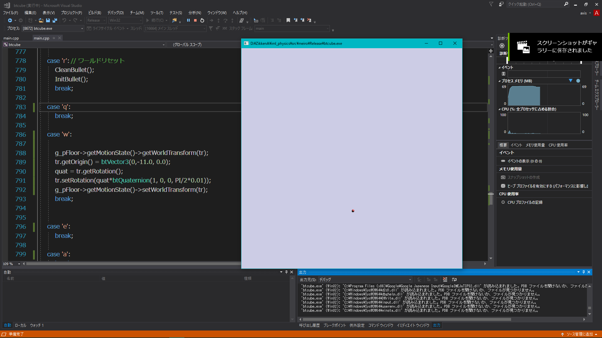
<dl>
	<dt>[2020/07/10 18:00] 藤澤誠</dt>
	<dd>これ球体の方が静止状態になってないですか(色かわっているし)．1度静止状態になると無理矢理動かすか他の動的なrigid bodyがぶつからないとそまま	静止したままになっちゃいます．球体の定義時にrigidbodyにsetActivationStateメンバ関数でDISABLE_DEACTIVATIONをセットすると静止状態ならないの	で試してみてください．</dd>
</dl>
<dl>
	<dt>[2020/07/10 18:04] 質問者</dt>
	<dd>このときは色々試してみようと思って逆にスリープ機能をオンにしていました<br />
	しかし    body1-&gt;setSleepingThresholds(0,0);    body1-&gt;setActivationState(DISABLE_DEACTIVATION);<br />
	を設定していても結果は変わりませんでした。<br />
	床をボールが落ちてくる前に上に移動させても床をすり抜けてそのしたの床が最初にあった位置で衝突してしまうなどもあってなぜこうなってしまうのかよくわかりません…</dd>
</dl>
<dl>
	<dt>[2020/07/10 18:53] 藤澤誠</dt>
	<dd>一度こちらで状況を再現してみました．床に対してkinematic objectということを指定しないと動かしたときに上手く衝突判定してくれないようです．床をbodyとしたら，<br />
	body-&gt;setCollisionFlags(body-&gt;getCollisionFlags() | btCollisionObject::CF_KINEMATIC_OBJECT); body-&gt;setActivationState(DISABLE_DEACTIVATION);<br />
	というのを追加してみて試してみてください．</dd>
</dl>


## 床を回転させるとその上のオブジェクトが飛ばされてしまう
床を下のようにして回転しているのですが、ボールを床の低い方に寄せて床を持ち上げるとボールがふっとばされてしまいます。
```
g_pFloor-&gt;getMotionState()-&gt;getWorldTransform(tr);<br />
quat = tr.getRotation();<br />
tr.setRotation(quat*btQuaternion(0, 0, 1, PI / 2 * -1*turnSpeed));<br />
g_pFloor-&gt;getMotionState()-&gt;setWorldTransform(tr);
```
・めり込んだ時の反発ばね定数を小さくしたら良いのかと思いましたが、何処で設定するのか検索しても見つけられませんでした。（g_pBallはbtRigidBodyです）
```
　　g_pBall-&gt;setDamping(0.1 ,0.1);<br />
　g_pBall-&gt;setContactStiffnessAndDamping(0.1, 0.1);
```
などかと思い設定してみましたが変わりませんでした。

・床の角速度ではなく回転を直接書き換えているのが原因かと考えて、g_pFloor-&gt;setAngularVelocityで動かそうとしましたがKineticなので動かせないことに気が付きました。

床は普通の剛体にした上で、静的な剛体を別に用意して、それにコンストレインでくっつけて回転させるのが良いでしょうか
Universal Constraintを使って試していますがまだ上手く行っていません（床の重みで勝手にぐるぐると回転します）

<dl>
	<dt>[2020/07/15 13:58] 藤澤誠</dt>
	<dd>反発はsetDampingではなく，setRestitution関数で設定できます(衝突応答のところの練習問題を見直してみてると良いかも)．ちなみにDampingは減衰という意味でbulletだと主に空気抵抗による速度減衰を表しています．なのでDampingはむしろ大きい方がはねにくいです(落下速度とかも遅くなりますが)．</dd>
	<dd>床とボールどちらにもsetRestitutionで反発係数0にしたとしても，床の運動で上部にある程度はねるのは仕方ないのですが，それも抑えたいならば，<br />
	・btGeneric6DofConstraintで床に対してx,z方向だけ動くようなconstraintを作成する<br />
	・床の左右前後および上部に別のboxを設定し，それをDrawBulletObjects関数内で描画しないようにする<br />
	という方法が考えられます．後者については床に透明なケースを付けるようなイメージですね．</dd>
</dl>
<dl>
	<dt>​[2020/07/15 14:08] 質問者</dt>
	<dd>床と玉の反発係数を0にしても遥か上空に飛んでいってしまうようなので、まずはbtGeneric6DofConstraintを試してみます
	ありがとうございます。</dd>
</dl>
<dl>
	<dt>​[2020/07/15 14:10] 藤澤誠</dt>
	<dd>こちらで試している限り，床を動かしても↑の動画のように遙か上空に飛んでいくということはありません．玉の質量が軽すぎるか，床を1度に動かしすぎているかのどちらかのような気がします．</dd>
</dl>
<dl>
	<dt>​[2020/07/15 14:21] 質問者</dt>
	<dd>床の動かし方はKeyboard関数の中で</dd>
</dl>

```
	const btScalar PI = 3.1419;//
	btTransform tr;
	btQuaternion quat;
	const float turnSpeed = 0.0001;        
	g_pFloor-&gt;getMotionState()-&gt;getWorldTransform(tr);
	quat = tr.getRotation();
	tr.setRotation(quat*btQuaternion(1, 0, 0, PI/2*-1*turnSpeed));
	 g_pFloor-&gt;getMotionState()-&gt;setWorldTransform(tr);
```

<dl>
	<dd>などとしています。見た目的にもかなりゆっくり回っているように見えました
	玉の重さは10000でした
	もう一度見直してみましたが何処が原因かわかりませんでした。<dd>
	<dt>[2020/07/15 14:36] 藤澤誠</dt>
	<dd>重さ10000は大きいね．重さの単位はkgだと考えれば良いので10tのボールになってしまっています．ただ，こちらで10000に設定しても問題はなかったです．あと，上の方で設定してたsetContactStiffnessAndDampingは使わないならば削除しておいた方がよさそう．マニュアルやwebにもはっきりとした情報を見つけられなかったけど柔らかい(反発するような)衝突を設定するのに使われるようです．少なくとも関数内でstiffnessで割るという計算があると書いてあるので0.1で割られて反発速度が10倍とかになってる可能性もあり．</dd>
</dl>
<dl>
	<dt>[2020/07/15 14:41] 質問者</dt>
	<dd>現在の設定は以下のようになっていますが飛んでいってしまいます
	何度も申し訳ないです…玉はこれでもかと重くしてみましたがだめでした</dd>
</dl>

```
	void SetFirstRigidBodies(void) 
	{​​
	    // ----- 地面 -----
	    btCollisionShape *ground_shape = new btBoxShape(btVector3(3, 0.05, 3));
	    // 形状
	    btVector3 trans=btVector3(0,  - 0.01, 0);
	    // 上の面がy=0になるように設定
	    g_pFloor = AddObj(ground_shape,trans,RX_COL_GROUND, RX_COL_GROUP1 | RX_COL_GROUP2,0);
	    // Body
	    g_pFloor-&gt;setCollisionFlags(g_pFloor-&gt;getCollisionFlags() | btCollisionObject::CF_KINEMATIC_OBJECT);
		g_pFloor-&gt;setActivationState(DISABLE_DEACTIVATION);
		 g_pFloor-&gt;setRestitution(0);
	    // ---------------------- 玉 ----------------------------
	    btCollisionShape *sshape = new btSphereShape(BALL_R);
	    btVector3 startPos = btVector3(0,2,0);
	    g_pBall = AddObj(sshape,startPos,RX_COL_GROUP2,RX_COL_GROUND|RX_COL_GROUP1,100);
	    g_pBall-&gt;setActivationState(DISABLE_DEACTIVATION);
	    g_pBall-&gt;setFriction(0.8);
	    g_pBall-&gt;setDamping(0.3, 0.3);
		g_pBall-&gt;setRestitution(0);
	}​​​​​​​​​
	btRigidBody* AddObj(btCollisionShape* shape, btVector3 pos, unsigned TAG, unsigned TARGET, float mass = 1.0 ,int index=0) {​​​​​​​​​​​​​​​​
	    // 初期位置・姿勢
	    btQuaternion qrot(0, 0, 0, 1);
	    btTransform trans;
	    // 剛体オブジェクトの位置姿勢を格納する変数(行列)
	    trans.setIdentity();
		// 位置姿勢行列の初期化
	    trans.setOrigin(pos);
	    trans.setRotation(qrot);
	    // 四元数を行列に変換して姿勢行列に掛け合わせる
	    // 剛体オブジェクト生成     
		btRigidBody* body1 = CreateRigidBody(mass, trans, shape, index, TAG, TARGET);
	    g_vCollisionShapes.push_back(shape); // 最後に破棄(delete)するために形状データを格納しておく
	    return body1;
	}​​​​​​​​​​​​​​​
```	

<dl>
	<dt>​[2020/07/15 14:50] 藤澤誠</dt>
	</dt>うーん，設定的には問題なさそう．他の部分が原因かもしれないので一度cppファイルをおくってください．</dd>
</dl>
<dl>
	<dt>​[2020/07/15 14:51] 質問者</dt>
	<dd>お願いします…<br/>
	[main (2).cpp]</dd>
</dl>
<dl>
	<dt>[2020/07/15 15:21] 藤澤誠</dt>
	<dd>問題はrigidbodyの定義ではなく，床を回転させているところのようです．左右回転だけですが以下のように変えたら飛ばなくなりました．</dd>
</dl>

```
	case 'a':
	{
	g_pFloor-&gt;getMotionState()-&gt;getWorldTransform(tr);
	quat = tr.getRotation();
	double ang = -PI/2*turnSpeed;
	quat *= btQuaternion(0, 0, sin(0.5*RX_TO_RADIANS(ang)), cos(0.5*RX_TO_RADIANS(ang)));
	tr.setRotation(quat);
	g_pFloor-&gt;getMotionState()-&gt;setWorldTransform(tr);
	}​​​​​​​​​​​​​​​​​
	break;
	case 'd':
	{​​​​​​​​​​​​​​​​​
	g_pFloor-&gt;getMotionState()-&gt;getWorldTransform(tr);
	quat = tr.getRotation();
	double ang = PI/2*turnSpeed;
	quat *= btQuaternion(0, 0, sin(0.5*RX_TO_RADIANS(ang)), cos(0.5*RX_TO_RADIANS(ang)));
	tr.setRotation(quat);
	g_pFloor-&gt;getMotionState()-&gt;setWorldTransform(tr);
	}​​​​​​​​​​​​​​​​​
	break;
```

<dl>
	<dd>要するに「１．物理シミュレーションとは？」のところでやった，角度から四元数を計算する式をちゃんと計算すれば問題ないと言うことです．表示上は床もちゃんと回転していますが，回転とは別の部分で四元数がおかしくなっていて，それが衝突応答の計算に効いてきたというのが原因かと．</dd>
	<dd>↑のコード例だとturnSpeedは単純に角度[deg]になるので1とか設定しておいてください．後RX_TO_RADIANS関数はdegからradへの変換をしています(実験サンプルコードにも含まれているので質問者のところでも使えるはず)．</dd>
</dl>
<dl>
	<dt>[2020/07/15 16:02] 質問者</dt>
	<dd>ありがとうございます！修正します</dd>
</dl>


## 視点の初期化について
操作中の場面の切り替わり時や、キーボードの入力などを受けて視点を初期状態に戻したいのですが、InitGL関数内の
```
// 視点の初期化
g_tbView.SetScaling(-7.0);
g_tbView.SetTranslation(0.0, -2.0);
```
の部分を使ってみたところ、視点を戻せませんでした。keybord関数などで視点を初期化したい際はどのように書いたら良いでしょうか。
<dl>
	<dt>[2020/07/22 12:55] 藤澤誠</dt>
	<dd>↑のコードだとスケーリングと平行移動だけが初期化され，回転部分が変わっていません．回転部分も初期化するならば以下のようにしてみてください．</dd>
</dl>

```
	g_tbView.SetScaling(-7.0);
	g_tbView.SetTranslation(0.0, -2.0);
	double q[4] = {​​​​​​​ 1, 0, 0, 0 }​​​​​​​;
	g_tbView.SetQuaternion(q);
```

<dl>
	<dd>SetQuaternion関数に単位四元数を与えることで初期化しています．</dd>
</dl>
<dl>
	<dt>[2020/07/22 12:57] 質問者</dt>
	<dd>意図したように動きました。ありがとうございます。</dd>
</dl>
<dl>
	<dt>​[2020/07/22 12:58] 藤澤誠</dt>
	<dd>
	ちなみに，<br />
	double q0[4];<br />
	g_tbView.GetQuaternion(q0);<br />
	とすると現在の視点の回転を表す四元数が得られるのでそれを記録しておけば，任意の視点を初期姿勢に設定することも出来ます．</dd>
</dl>


## オブジェクトの前方方向を表す単位ベクトルを取得したい
対象オブジェクトの前方の単位ベクトルを取得したいのですが、下のコードだとtankdirが(0.000289, -1.000000, -0.000568)といったようにy座標が大きくなる上、方向もまちまちになってしまいます、どうしたら良いのでしょうか？
```
	// tankの位置、回転取得
    btTransform tankTrans;
    tank->getMotionState()->getWorldTransform(tankTrans);
    btVector3 tankPos = tankTrans.getOrigin();
    btQuaternion tankRot = tankTrans.getRotation();
    tankRot = tankRot.inverse();
    btVector3 tankDir = btVector3(tankRot[0], tankRot[1], tankRot[2]);
    tankDir.normalize();
    // 初期位置・姿勢
    btTransform cannonballTrans;    // 剛体オブジェクトの位置姿勢を格納する変数(行列)
    cannonballTrans.setIdentity();// 位置姿勢行列の初期化
    btQuaternion qrot= btQuaternion(0, 0, 0, 1);
    cannonballTrans.setOrigin(tankPos);
    cannonballTrans.setRotation(qrot);    // 四元数を行列に変換して姿勢行列に掛け合わせる
	...
    cannonball>setLinearVelocity(btVector3(tankDir*speed));
```
対象にしているオブジェクトは
```
	const btVector3 bodySize = btVector3(0.7, 0.3, 1.0);
```
で生成しています
<dl>
	<dt>[2020/07/22 13:17] 藤澤誠</dt>
	<dd>オブジェクト前方のベクトルがほしい場合は，オブジェクトの初期状態での前方ベクトル(車とかの例なら(0,0,-1))をtankRotで回転させればOKです．以下は私の手元のコードで試した例です．</dd>
</dl>

```
	btTransform trans;
	g_pCarBody->getMotionState()->getWorldTransform(trans);
	btVector3 p = trans.getOrigin();
	btQuaternion q = trans.getRotation();
	btVector3 d(0, 0, -1);
	d = d.rotate(q.getAxis(), q.getAngle());
	d.normalize();
	cout << d.x() << ", " << d.y() << ", " << d.z() << endl;
```

<dl>
	<dd>d(0,0,-1)を変えれば，上方向(0,1,0)や前方斜め上(0,1,-1)とかも取得できます．</dd>
</dl>
<dl>
	<dt>[2020/07/22 13:26] 質問者</dt>
	<dd>初期状態で望む方向を向いたベクトルにかければよかったんですね!</dd>
</dl>


## 読み込めるワールドの広さを広くしたい
読み込めるワールドの広さを広くしたいのですが、どこのコードをいじれば良いのかわかりません。教えていただけるとありがたいです
<dl>
	<dt>[2020/07/28 11:08] 藤澤誠</dt>
	<dd>bulletだと特にワールドの大きさを定義はしていないです(BroadPhaseでbtAxisSweep3を使っている場合はそこで範囲を設定されているぐらい)．そのため，自由に大きなオブジェクトとかを読み込んだりしてくれてOKです．後は床をBoxとかで定義している場合はその大きさを変えたり，初期視点位置を後ろに下げたり(InitGL関数内のg_tbView.SetScaling(-7.0);のところの-7.0を-15.0とかにする)すれば良いかと思います．</dd>
</dl>
<dl>
	<dt>​[2020/07/28 11:12] 質問者</dt>
	<dd>初期視点位置をz軸の正の方向に大きくするともともとの初期視点位置で見えていたものが見えなくなってしまうみたいなことが起きてしまって、これは物体を小さくしないといけないのでしょうか</dd>
</dl>
<dl>
	<dt>​[2020/07/28 11:15] 藤澤誠</dt>
	<dd>初期視点位置はマイナス方向に移動するようにしてください．z軸は視点の方を向いているので値を小さくするほど視点位置が後ろに下がります(OpenGLは右手座標系なのでz軸の向きがあまり直感的ではないんですよね)．</dd>
</dl>
<dl>
	<dt>​[2020/07/28 11:19] 質問者</dt>
	<dd>すいません。あまりよく理解できていないんですが、視点を後ろに下げるともともとの視点から見えていたものが見えなくなるというのが現在の課題で、それを解決するためには物体の大きさを変えるしかないって感じなんでしょうか</dd>
</dl>
<dl>
	<dt>​[2020/07/28 11:24] 藤澤誠</dt>
	<dd>ごめんなさい．勘違いしていました．サンプルプログラムなら負の方向にすると視点が後ろに下がります...　あと，あまりに下げすぎるとクリッピングの範囲に入ってしまうので，その場合はProjection関数内のgluPerspectiveに設定している最後の引数(デフォだと1000.0f)を大きくしてみてください．</dd>
	<dd>あともう一つ，影が上手く出ない可能性ありなので，その場合はRX_LIGHT0_POSという光源位置を表すグローバル変数の中身を変えてください(オブジェクトが大きくなったらそれに合わせて光源位置をもっと高くする必要あり)．</dd>
	<dd>↑影についてはDisplay関数内の<br />
	rxFrustum light = CalFrustum(90, 0.02, 50.0, g_iShadowMapSize, g_iShadowMapSize, light_pos, Vec3(0.0));<br />
	というところの3番目の引数(50.0)をもっと大きくする必要もあるかもしれません(少なくとも光源の高さ以上に設定)．</dd>
	<dd>ちなみにOpenGLのz軸は手前向きなのですが，サンプルプログラムでは視点を動かすのではなく，実際にはオブジェクトを含む座標系を動かすので，視点位置は(0,0,0)のままワールド全体を負の方向に移動させるというイメージです．</dd>
</dl>
<dl>
	<dt>[2020/07/28 11:31] 質問者</dt>
	<dd>視点ではなく、視点以外を動かして視点が動いているように見せてたんですね、理解しました。それとgluPerspectiveの最後の引数は20.0fとかでしたが、その値を大きくしたら解決しました。ありがとうございます。影についてはまだ試してませんが、わからないことがあったらまた質問させていただきます。授業時間外のお忙しい中、時間を割いていただきありがとうございました。</dd>
</dl>


## Projection関数？
ハマってしまってたので一応共有です。

以下を参考にProjection関数ないのgluPerspectiveの引数の値をいろいろ変えたんですけど反映されず。困ってたんですが
Resize関数の中でもgluPerspectiveを呼び出しているのでそっちの引数も変える必要があるというのが原因でした。
加えてresize関数の中ではzFarの初期値が20.0fになっているので注意です。
<dl>
	<dt>​[2020/07/29 11:54] 藤澤誠</dt>
	<dd>指摘ありがとう．そもそもProjection関数は以前は影を付けるルーチンから使っていたのですが，その後変更して使わなくなっていたのが残っていました(なのでProjection関数を削除しても問題ありません)．指摘してくれたとおりResize関数内のgluPerspectiveの引数を変えるのが正しいです．</dd>
</dl>


## 衝突点の描画でエラーが出る
[http://www.slis.tsukuba.ac.jp/~fujisawa.makoto.fu/lecture/iml/text/3_collision.html](http://www.slis.tsukuba.ac.jp/~fujisawa.makoto.fu/lecture/iml/text/3_collision.html)

この衝突点のところのオプション問題7を実装しようとしているのですが、
衝突点描画の箇所(// ここに衝突点情報を格納するor衝突点描画するコードを書く のコメントの後)で以下の命令を入れてみるとスクリーンショットのようなエラーが出てきてしまいます。
```
g_pDynamicsWorld-&gt;removeCollisionObject(obA);
```
ヘッダファイルの方で何かエラーが出ているのですが、ggっても解決しそうなページも出てこず、困っています。どういったことが原因としてありそうでしょうか？
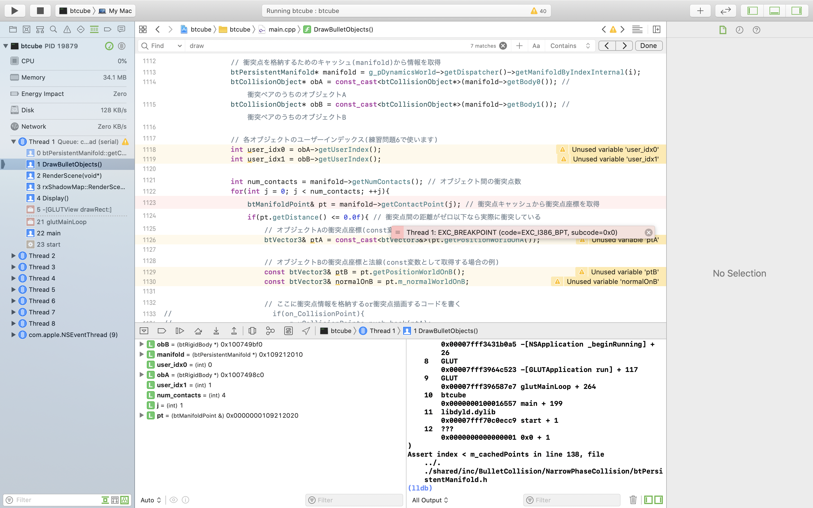
<dl>
	<dt>[2020/07/30 13:40] 藤澤誠</dt>
	<dd>うーん，不確定だけど，removeCollisionObjectの後でbreakしてfor文を抜けるようにしていますか？一つの物体で2カ所以上同時に衝突点があると1カ所目の処理で物体が消えて，2カ所目を処理しようとしてもその物体がdeleteされていてエラーが出ているとか？</dd>
</dl>
<dl>
	<dt>​[2020/07/30 13:49] 質問者</dt>
	<dd>確かに、それが原因なようです。breakしていませんでした。すみませんありがとうございます。</dd>
</dl>


## レポートの表紙の概要欄には何を記述すればよい？
レポートについて質問です。
作成したアプリケーションについての概要は本文にてまとめたのですが、サンプルの表紙にある概要の欄には何について記せば良いのでしょうか。
<dl>
	<dt>[2020/08/03 12:09] 藤澤誠</dt>
	<dd>アプリケーションの目的や結果について概要を書いてくれればと思います．本文に概要があるならばそれのコピーでもOKです．元々配布されていた実験表紙(PDF)と同じになるように作ったものなので概要は適当でも問題ありません．</dd>
</dl>
