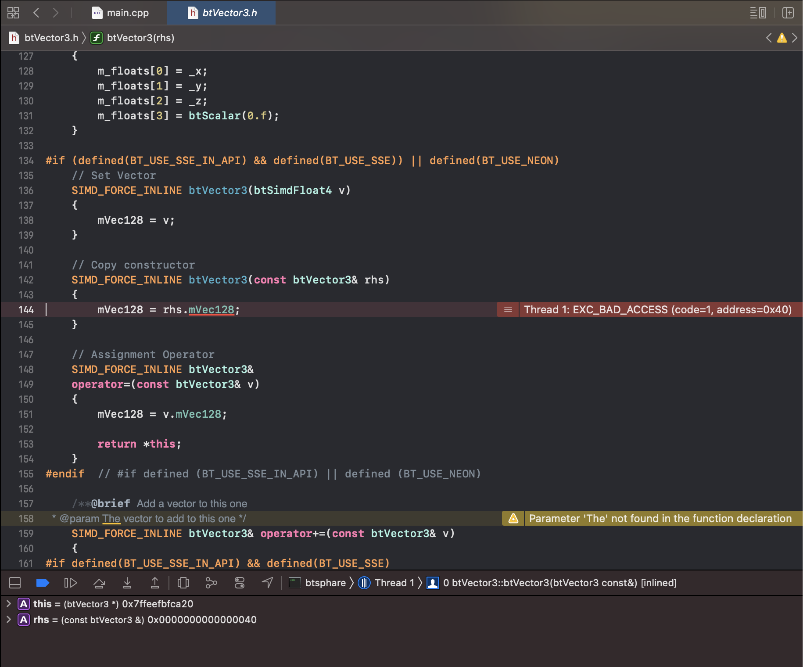
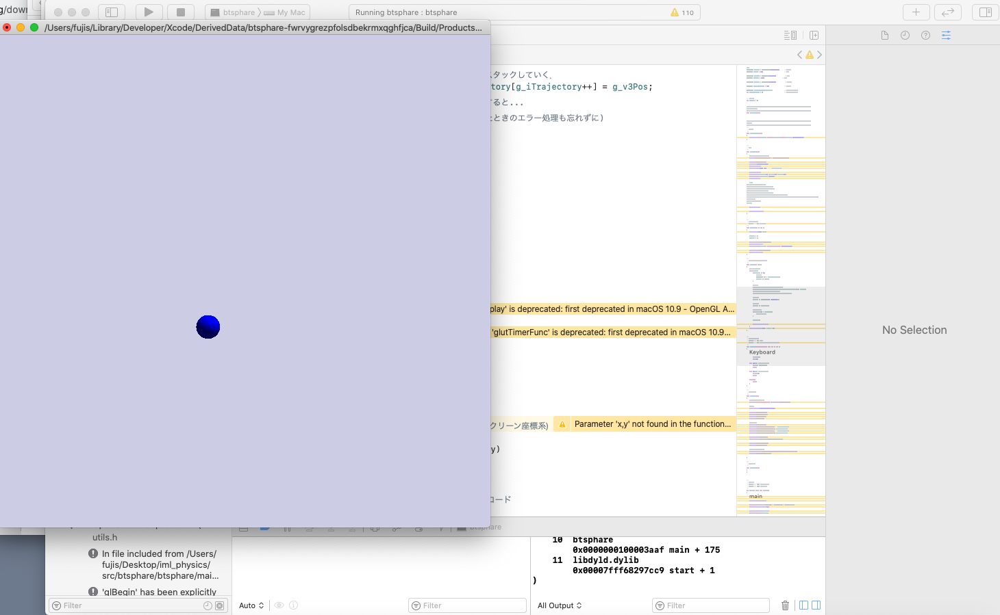
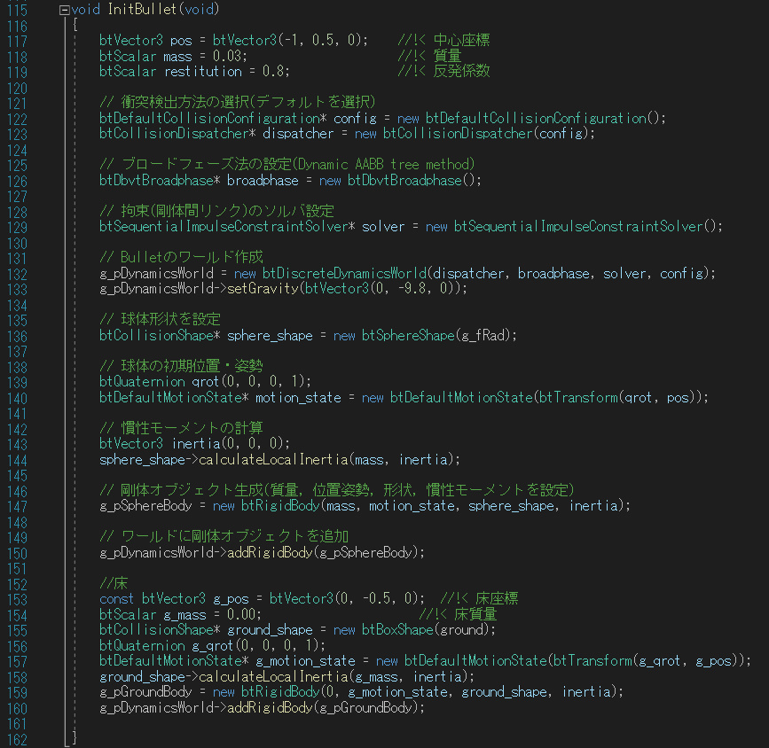
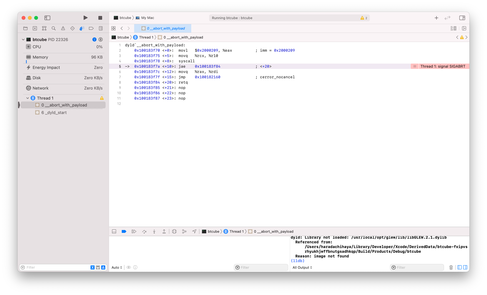
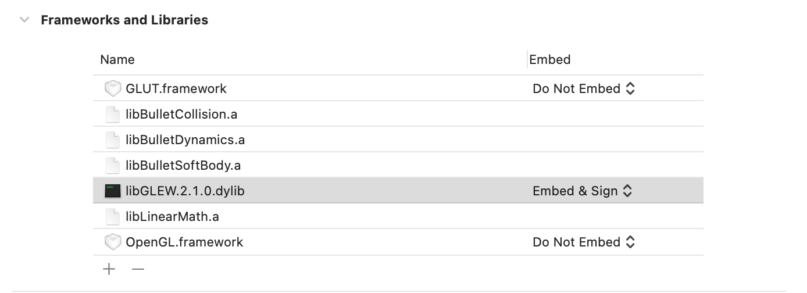
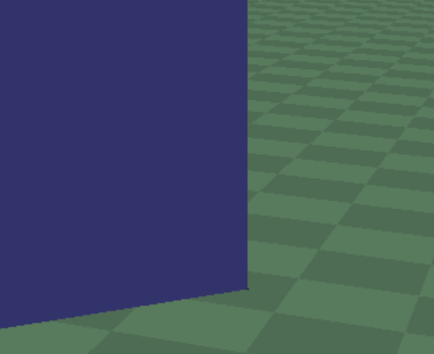
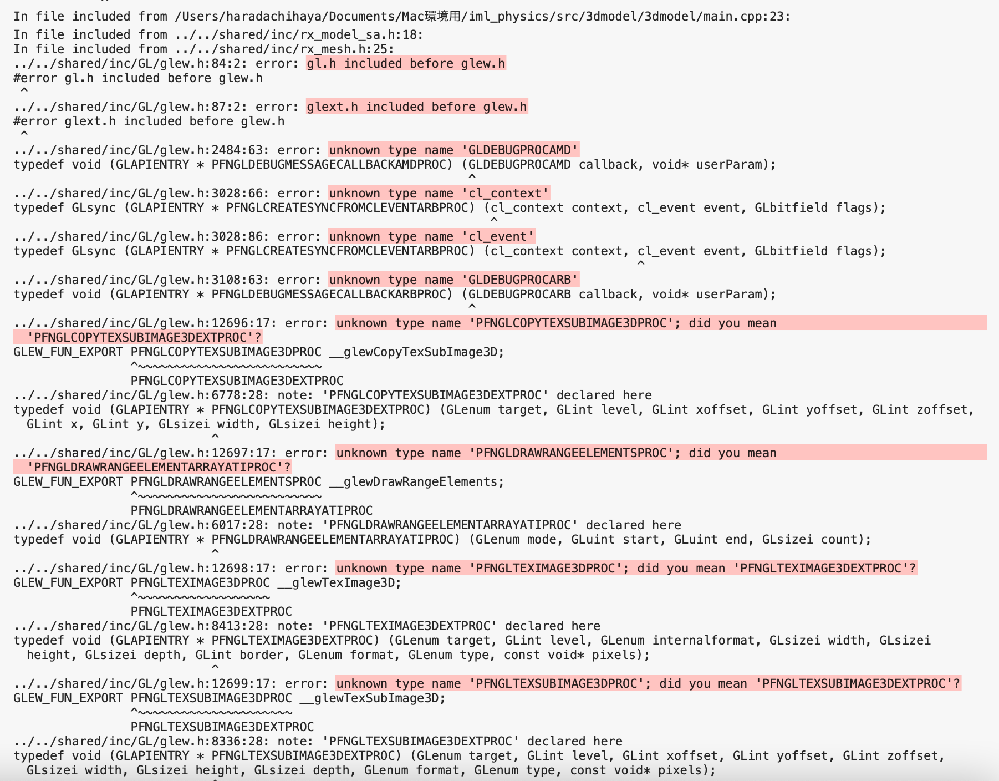
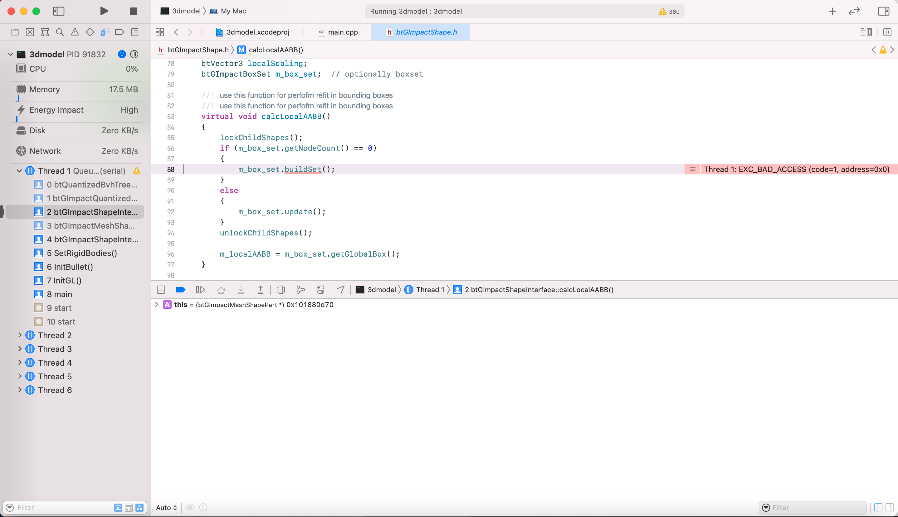
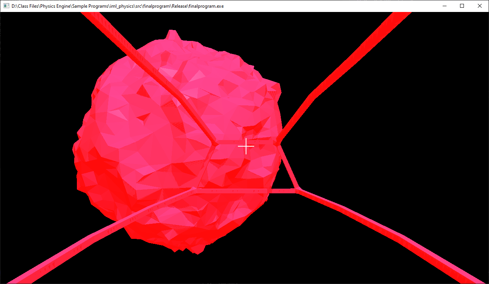

## 質問
練習問題５に詰まってしまったので質問です。
添付した動画のように、ボックスのサイズも変わってしまうのですが、なぜなのでしょうか。
（関数Rotate2(x,y,z)でx,y,zを軸にした回転行列boxRotate2を作っているつもりです。）

[動画](fig/iml_physics_qa2021_001.mov)


<dl>
	<dt>[2021/04/23 17:53] TA</dt>
	<dd>
練習問題4にあるようにglMultiMatrixfは平行移動とスケーリングも扱っているのでboxRotate2の中身が間違っているかもしれません
	</dd>
</dl>
<dl>
	<dt>[2021/04/23 17:56] 藤澤誠</dt>
	<dd>
TA今井君が言っているように回転行列の中身がおかしい可能性があります．四元数から回転行列への変換部分をもう一度見直してみるとよささそうです．
​	</dd>
</dl>
<dl>
	<dt>[2021/04/23 17:58] 質問者</dt>
	<dd>
返信ありがとうございます！単位ベクトルで指定するとできるのですが、練習問題5の軸の指定は、単位ベクトルでしたか？
	</dd>
</dl>
<dl>
	<dt>[2021/04/23 17:59] 藤澤誠</dt>
	<dd>
たぶん軸が単位ベクトルでないので，四元数への変換で単位四元数になっていないのではないかと思います．回転軸は基本的に単位ベクトルで指定した方が安全です．
​	</dd>
</dl>
<dl>
	<dt>[2021/04/23 18:00] 質問者</dt>
	<dd>
そうなんですか。承知しました。ありがとうございます。
	</dd>
</dl>


## 質問
練習問題6についての質問です。
回転を表す四元数をq、回転を表す3次元ベクトル（オイラー角）をθとします。ωΔtを四元数に変換してからqに掛け算するのと、ωΔtをθにそのまま足してからθをqに変換するのでは計算結果は変わりますか？
（2つの方法を実験して比べてみたところ、目視では回転の動きに変化がないように見えました。）

<dl>
	<dt>[2021/04/23 17:49] 質問者</dt>
	<dd>
もう少し実験して見ると、斜め方向のトルク（(0.0, 0.1, 0.1)のようなもの）を与えると2つの方法で回転の動きが変化したように見えました。
​	</dd>
</dl>
<dl>
	<dt>[2021/04/23 17:53] 藤澤誠</dt>
	<dd>
x軸まわりのみの回転(オイラー角が(90,0,0)とか)なら変わらないと思います．オイラー角の場合，複数の軸が含まれると回転角度次第ですが，回転軸が重なり(ジンバルロック)，動きが変化する可能性はありです．
​	</dd>
</dl>
<dl>
	<dt>[2021/04/23 17:57] 質問者</dt>
	<dd>
返信ありがとうございます。確かに(0.0, 0.1, -0.1)のトルクで実行すると2つ目の方法ではジンバルロックの影響があるのか少し不自然に回転しているように見えました。
​	</dd>
</dl>
<dl>
	<dt>[2021/04/23 17:57] 藤澤誠</dt>
	<dd>
その辺で四元数を使う理由を感じてもらえればと思います(smile)
​	</dd>
</dl>
<dl>
	<dt>[2021/04/23 17:59] 質問者</dt>
	<dd>
追加で質問です。
角加速度により角速度を変化させるときは、両方ともオイラー角のままで計算することによりジンバルロックのような影響が出ることはありますか？
	</dd>
</dl>
<dl>
	<dt>[2021/04/23 18:01] 藤澤誠</dt>
	<dd>
最終的なθの変化量を求めているのではないので最後のところで四元数を使っていれば大丈夫だと思います．
​	</dd>
</dl>
<dl>
	<dt>[2021/04/23 18:04] 質問者</dt>
	<dd>
了解しました、ありがとうございます。
​	</dd>
</dl>
<dl>
	<dt>[2021/04/23 18:56] 質問者</dt>
	<dd>
回転ベクトルについての質問なのですが、計算の途中に出てくる角速度（ω）のようなベクトルは、ベクトルの方向が回転軸の向き、ベクトルの長さが回転角度（または速度、加速度）を表すという認識で良いですか？それともこれらのベクトルの3成分はそれぞれx, y, z軸周りの回転角度を表しているのでしょうか。
	</dd>
</dl>
<dl>
	<dt>[2021/04/23 19:02] 藤澤誠</dt>
	<dd>
実験ページでのベクトルωは後者のx,y,z軸周りの単位時間あたりの回転角度(回転速度)ですね．ただし，前者の方向を回転軸，長さを回転角度とする表し方もあります(流体力学という分野の渦度というパラメータとかで使われてる表し方ですね)．
	</dd>
</dl>


## 質問
今回の課題の練習問題1についてなのですが、
ビルド時に「'RuntimeLibrary' の不一致が検出されました。値 'MTd_StaticDebug' が MDd_DynamicDebug の値 'main.obj' と一致しません。」というエラーが出てしまいます。
何か解決法はありますでしょうか？
btcubeのサンプルはうまく動くのですが...
<dl>
	<dt>[2021/04/30 16:14] 質問者</dt>
	<dd>
分からなかったのでとりあえずbtcubeのプロジェクトファイルコピーしてmain.cpp書き換えでやることにしました。
​	</dd>
</dl>
<dl>
	<dt>[2021/04/30 16:16] TA</dt>
	<dd>
リンカーエラーなのでlibファイルのどこかに不具合があるかもしれないです
​	</dd>
</dl>
<dl>
	<dt>[2021/04/30 16:17] 質問者</dt>
	<dd>
了解しました。ありがとうございます。
​	</dd>
</dl>
<dl>
	<dt>[2021/04/30 16:17] 藤澤誠</dt>
	<dd>
すいません，去年も同じ質問が来てサンプルプログラムを直したつもりで直ってなかったようです... 先ほどの説明で見せたプロジェクトのプロパティの C/C++→コード生成 でランタイムライブラリをReleaseモードなら「マルチスレッド」，Debugモードなら「マルチスレッドデバッグ」にしてください．
​	</dd>
</dl>
<dl>
	<dt>[2021/04/30 16:18] 藤澤誠</dt>
	<dd>
たぶん今の設定は「マルチスレッドDLL」になっていると思います．
​	</dd>
</dl>
<dl>
	<dt>[2021/04/30 16:21] 藤澤誠</dt>
	<dd>
ちなみにこの設定は先ほども説明したライブラリファイルのリンクに関わるもので，リンク時にlibファイルの内容を実行ファイルに加えるのがDLLが付いていない方で，DLLが付いた方は内容までは加えずに代わりに実行時にDLLファイルを使うという設定です．前者は実行ファイル以外に余計なファイルが必要ないけど，実行ファイルサイズが大きくなるという特徴があり，後者はその逆です(なのでどちらを使うかは好みですがBulletのデフォルトはDLLを使わない設定のようです)．
	</dd>
</dl>


## 質問
先ほど説明のあった○○君の質問の返答について、同時並行でなかったので再度似通った質問になってしまうのですが、
'RuntimeLibrary' の不一致が検出されました。値 'MT_StaticRelease' が MTd_StaticDebug の値 'bChunk.obj' と一致しません。というエラーが出てしまいます。
ランタイムライブラリはマルチスレッドデバッグにしています。
<dl>
	<dt>[2021/04/30 17:34] 藤澤誠</dt>
	<dd>
こちらはReleaseモード用のライブラリをDebugモードでリンクしようとしていますね．MT_StaticReleaseでマルチスレッド,DLLなし(static),Releaseモードという意味合いで，MTd_StaticDebugはマルチスレッドデバッグ,DLLなし(static),Debugモードということです．
​	</dd>
</dl>
<dl>
	<dt>[2021/04/30 17:36] 藤澤誠</dt>
	<dd>
説明ページでlibフォルダにReleaseでビルドしたもの，lib_debugフォルダにDebugでビルドしたものという指定があったと思うんですが，そこの部分で間違ったフォルダに入れてしまったのではないかと(lib_debugにReleaseでビルドしたものが入っている可能性大)．
​	</dd>
</dl>
<dl>
	<dt>[2021/04/30 17:37] 質問者</dt>
	<dd>
試してみます
​	</dd>
</dl>
<dl>
	<dt>[2021/04/30 17:42] 質問者</dt>
	<dd>
同様の結果になってしまったのでビルドからやり直してみます
​	</dd>
</dl>
<dl>
	<dt>[2021/05/04 19:07] 質問者</dt>
	<dd>
デモプログラム実行できました
	</dd>
</dl>


## 質問
Macでのデモプログラムの実行方法が分かりません。
<dl>
	<dt>[2021/05/07 13:26] TA</dt>
	<dd>
bulletのビルドはできていますか？
​	</dd>
</dl>
<dl>
	<dt>[2021/05/07 13:29] 質問者</dt>
	<dd>
Mac環境用をDLして用いています。
説明ページと見比べた感じできていると思います。
​	</dd>
</dl>
<dl>
	<dt>[2021/05/07 13:31] 藤澤誠</dt>
	<dd>
「ファイル」に置いてあるMac環境用のにはBulletデモプログラムは入っていません．Bulletのデモプログラムを実行したい場合は，mac環境でのbulletのビルドを試してみてください(参考ページ: http://blog.livedoor.jp/tek_nishi/archives/10156724.html )
​	</dd>
</dl>
<dl>
	<dt>[2021/05/07 13:32] 質問者</dt>
	<dd>
ありがとうございます。
​	</dd>
</dl>
<dl>
	<dt>[2021/05/07 13:33] 質問者</dt>
	<dd>
参考ページで「あとは「ALL_BUILD」SchemeでビルドすればOK。」とあるのですが、その操作が何を指すのかわかりませんでした。
​	</dd>
</dl>
<dl>
	<dt>[2021/05/07 13:35] 藤澤誠</dt>
	<dd>
xcodeでTARGETSというところに色々なプロジェクトが並んでいる中の「ALL_BUILD」をビルドすると全てのプロジェクトがビルドされるということだと思います(xcodeはほとんど使ったことがないので予想ですが...)．
​	</dd>
</dl>
<dl>
	<dt>[2021/05/07 13:38] 藤澤誠</dt>
	<dd>
最近，古いmac miniを引っ張り出して使えるようにしたので私の方でも少し試してみます．
​	</dd>
</dl>
<dl>
	<dt>[2021/05/07 13:40] 質問者</dt>
	<dd>
ありがとうございます。
​	</dd>
</dl>
<dl>
	<dt>[2021/05/07 14:17] 質問者</dt>
	<dd>
ALL_BUILD はわからなかったのですが、READMEを参考に、無事デモプログラムが実行できました。
	</dd>
</dl>


## 質問
質問です。練習問題１を実行したところbtVector3.hで"Thread 1: EXC_BAD_ACCESS (code=1, address=0x40)."というエラーが出てしまいます。どうすればいいでしょうか。



<dl>
	<dt>[2021/05/12 12:51] 質問者2</dt>
	<dd>
macです。同じところで詰まっています。
​	</dd>
</dl>
<dl>
	<dt>[2021/05/12 13:00] 藤澤誠</dt>
	<dd>
xcodeで原因が特定しづらいことで有名なエラーですね... ちなみに自分でビルドしたbulletのライブラリを使っていますか？それともxcode用のサンプルを使っていますか？
​	</dd>
</dl>
<dl>
	<dt>[2021/05/12 13:00] 質問者2</dt>
	<dd>
僕はサンプル使いました。
​	</dd>
</dl>
<dl>
	<dt>[2021/05/12 13:02] 藤澤誠</dt>
	<dd>
私の手元のmac環境でやってみるので少しお待ちを．
​	</dd>
</dl>
<dl>
	<dt>[2021/05/12 13:04] 質問者</dt>
	<dd>
私もです。お願いします
​	</dd>
</dl>
<dl>
	<dt>[2021/05/12 13:20] 藤澤誠</dt>
	<dd>
うーん，手元の環境だと特に問題なく実行できます．
​	</dd>
</dl>



<dl>
	<dt>[2021/05/12 13:20] 藤澤誠</dt>
	<dd>
mac os と xcode のバージョンはいくつですか？
​	</dd>
</dl>
<dl>
	<dt>[2021/05/12 13:21] 藤澤誠</dt>
	<dd>
ちなみにこちらは macOS Catalina ver10.15.7 & xcode ver12.4 (12D4e) です．
​	</dd>
</dl>
<dl>
	<dt>[2021/05/12 13:22] 質問者</dt>
	<dd>
macOSはBig Surのバージョン11.1、xcodeはver12.4 (12D4e)です。
	</dd>
</dl>
<dl>
	<dt>[2021/05/12 13:23] 質問者2</dt>
	<dd>
macOS Catalina var10.15.7 & xcode ver11.4.1 (11E503a) です。
	</dd>
</dl>
<dl>
	<dt>[2021/05/12 13:27] 藤澤誠</dt>
	<dd>
少なくとも岡村さんはバージョン的には問題なさそうですね．書いたコードを送ってくれませんか(とりあえずmain.cppだけでOK)？
​	</dd>
</dl>
<dl>
	<dt>[2021/05/12 13:29] 質問者</dt>
	<dd>
お願いします！

[main.cpp]
​	</dd>
</dl>
<dl>
	<dt>[2021/05/12 13:35] 藤澤誠</dt>
	<dd>
とりあえずもらったコードで同じエラーが出ることは確認できたので，エラーが出てないコードと比較してみます．
​	</dd>
</dl>
<dl>
	<dt>[2021/05/12 13:37] 質問者</dt>
	<dd>
ありがとうございます。お願いします
​	</dd>
</dl>
<dl>
	<dt>[2021/05/12 13:40] 藤澤誠</dt>
	<dd>
たぶんですけど，InitBullet関数を作っているけどそれをどこからも呼び出していないのが原因かと．説明ページの中の「InitBullet()関数はInitGL関数内か，main関数の中で呼び出すようにしておく．」を見逃しているっぽい？
​	</dd>
</dl>
<dl>
	<dt>[2021/05/12 13:44] 質問者</dt>
	<dd>
できました！見逃していました。ありがとうございます
​	</dd>
</dl>
<dl>
	<dt>[2021/05/12 13:44] 藤澤誠</dt>
	<dd>
その状態でTimer関数内でBulletの変数を呼んだので，未定義のまま呼ばれてエラーが出たのではないかと．Timer関数の中では初期化をチェックするエラー処理をしているのですが，g_pSphereBodyとかの定義時に0で初期化してないと意味がないですね(こちらは実験ページの記載ミス)...
InitBulletをInitGL関数で，CleanBulletをCleanGL関数内で呼び出すようにして，念のため変数定義のところも以下のように書き換えておいてください(実験Webページの方も修正しておきます)．
	</dd>
</dl>

```
btDynamicsWorld* g_pDynamicsWorld = 0;    //!< Bulletワールド
btRigidBody* g_pSphereBody = 0;        //!< 球体
```


## 質問
練習問題2の地面の生成で地面が静止剛体になっておらず，動画のようにボールと共に落下します．
rigidbodyでmassを0にしているのですが、落下している為何らかの問題があると思われるInitBulletのスクリーンショットを添付しております。

[動画](fig/iml_physics_qa2021_014.mp4)



<dl>
	<dt>​[2021/05/12 19:08] TA</dt>
	<dd>
    動画を見た感じだと見えない床にぶつかって球が転がっているように見えるので静止物体として地面は生成できていると思います．Display関数で床をそのままの位置に描画するように設定してみてください．
​	</dd>
</dl>


## 質問
授業サイトのrx_shaders.hとrx_shadow_glsl.hを使うようにしてutils.hのインクルードも書き換えるとテクスチャーは大きくなりましたが地面が灰色になってしまいました。また、物体間に影はつくようになりましたが床にはつかないです。
タスクマネージャーによるとデバッグ時にはIntelでなくGTXの方のGPUを使っているようです。
<dl>
	<dt>[2021/05/12 14:53] 藤澤誠</dt>
	<dd>
すいません，rx_shadow_glsl.hの内容が古くなっているようです．次回までに更新しておくので今のところ前のrx_shadow_gl.hを使うようにしてください．
​	</dd>
</dl>
<dl>
	<dt>[2021/05/12 15:01] 質問者</dt>
	<dd>
了解しました、ありがとうございます。
​	</dd>
</dl>
<dl>
	<dt>[2021/05/14 16:34] 藤澤誠</dt>
	<dd>
rx_shadow_glsl.hを更新しておきました．使う場合は実験Webページから再ダウンロードしておいてください．glsl版の方はシェーダーでPhongシェーディングを計算している関係もあって全体的に暗くなっています．色を調整するか，rx_shadow_glsl.hの148-155行目で最終的な色の計算をしているシェーダーのコードがあるのでそこを適宜書き換えてみてください．
​	</dd>
</dl>
<dl>
	<dt>[2021/05/14 16:35] 質問者</dt>
	<dd>
授業ページからrx_shaders.hとrx_shadow_glsl.hをダウンロードし直したところ、床が緑になって影もつくようになりました。しかし影の大きさが一定でなく、点光源で照らされているかのような感じで大きさが変化してしまいます。
​	</dd>
</dl>
<dl>
	<dt>[2021/05/14 16:38] 藤澤誠</dt>
	<dd>
平行光源ではなく点光源なので光源に物体が近づくと影は大きくなります．rx_shadow_glsl.hの259行目の光源プロジェクション行列の設定を変えると平行光源も出来るかもしれません(試してないので本当に出来るか分かりませんが，原理的には可能)．
​	</dd>
</dl>
<dl>
	<dt>[2021/05/14 16:39] 藤澤誠</dt>
	<dd>
↑正確には指向性を持つ点光源ですね(スポットライトのようなもの)
​	</dd>
</dl>
<dl>
	<dt>[2021/05/14 16:40] 藤澤誠</dt>
	<dd>
あと，言い忘れていましたが，main.cppの変数g_iShadowMapSizeの値を大きくすると影の解像度が上がります．元のOpenGL版だとウィンドウサイズ以上には出来なかったんですが，glsl版はオフラインバッファを使うので自由に解像度が変えられます(2048とか4096とか)．
​	</dd>
</dl>
<dl>
	<dt>[2021/05/14 16:55] 質問者</dt>
	<dd>
gluPerspectiveを<br />
glOrtho(-5, 5, -5, 5, light.Near, light.Far);<br />
と書き換えて見ると平行光源のようになりました。（なんとなく試してみただけなのでこの関数の使い方がこれで合ってるかわからないです）
また、影の解像度をあげることもできました。
	</dd>
</dl>


## 質問
練習1においてmac環境用のbtcubeをそのままビルド実行した際、build succeededとは出るのですがその後画像のエラー(Thread 1: signal SIGABRT)が出てしまいました。どうすればいいでしょうか。



<dl>
	<dt>​[2021/05/14 17:14] TA</dt>
	<dd>
    サンプルプログラムを置いている場所はsrcフォルダの下ですか？
	</dd>
</dl>
<dl>
	<dt>​[2021/05/14 17:15] 質問者</dt>
	<dd>
    はい。sphereやbtsphereと同様にsrcフォルダの下にあります。
	</dd>
</dl>
<dl>
	<dt>​[2021/05/14 17:21] TA</dt>
	<dd>
    では画像右下のoutputの部分を全部貼っていただけますか．見えている範囲だとライブラリのロードでエラーが出ているっぽいですが他の原因の可能性もあると思うので．<br />
	[mac] ld: library not found for -lBulletDynamics というエラーが出る in 過去の質問<br />
	↑これの設定ができているかも確認してみてください．
	</dd>
</dl>
<dl>
	<dt>[2021/05/14 17:33] 質問者</dt>
	<dd>
こちらoutputになります。過去の質問については今から確認してみます。
​	</dd>
</dl>


<dl>
	<dt>[2021/05/14 17:52] 藤澤誠</dt>
	<dd>
昨年の実験でも同じようなエラーに関して質問があった気がしたので調べてみたら，過去の質問のところには抜けていますが(解決策が曖昧だったためと思われる)，同様のエラー(Thread 1: signal SIGRABRT)がありました．
「frameworksにあった余分なものを消したら動きました。」ということらしいです．
​	</dd>
</dl>
<dl>
	<dt>[2021/05/14 17:57] 質問者</dt>
	<dd>
こちらsearch Pathsですが、正しく設定されているでしょうか。。。
​	</dd>
</dl>


<dl>
	<dt>[2021/05/14 18:06] TA</dt>
	<dd>
pathはあっています．glew周りでエラーが出ているのでフレームワークからglewを外して試してみてください
​	</dd>
</dl>
<dl>
	<dt>[2021/05/14 18:13] 質問者</dt>
	<dd>
フレームワークからglewを外すと過去の質問にもあるUndefined symbol のエラーが出てしまいます。


​	</dd>
</dl>
<dl>
	<dt>[2021/05/14 18:21] 質問者</dt>
	<dd>
glewを戻して、現在フレームワークは画像のようになっているのですが過不足などありますか
​	</dd>
</dl>



<dl>
	<dt>[2021/05/14 18:25] 藤澤誠</dt>
	<dd>
glewが原因のようなので，glewを使わないバージョンを作りました．以下の2ファイルをダウンロードして，main.cppのフォルダにコピー(utils.hは上書き)して，frameworksあｋらlibGLEWを外してみてください．影が付かないですが，それ以外は問題ないと思います．
​	</dd>
</dl>

[rx_shadow_empty.h](fig/rx_shadow_empty.h)
[utils.h](fig/utils.h)

<dl>
	<dt>[2021/05/14 18:30] 質問者</dt>
	<dd>
ありがとうございます、これらを用いてビルドすることができました。
​	</dd>
</dl>
<dl>
	<dt>[2021/05/14 18:31] 藤澤誠</dt>
	<dd>
影がないとリアルさが1,2段階落ちる感じになるのがネックですね...  もし自分で調べて解決できたら教えてください．
​	</dd>
</dl>
<dl>
	<dt>[2021/05/14 18:32] 質問者</dt>
	<dd>
了解です。
	</dd>
</dl>


## 質問
練習問題４に関する質問です。
”CreateRigidBodyで剛体オブジェクトを生成した時にできたインスタンス (btRigidBody型のポインタ)をグローバル変数にして記録しておく”とありますが、インスタンスというものが調べてもうまく理解できず詰まっています。
剛体オブジェクト生成の際の「btRigidBody* body = CreateRigidBody(1.0, trans, box_shape, 0);」
のbodyというものがインスタンスという認識でよろしいでしょうか？

<dl>
	<dt>[2021/05/21 16:19] TA</dt>
	<dd>
その認識であっています．
​	</dd>
</dl>
<dl>
	<dt>[2021/05/21 16:21] 藤澤誠</dt>
	<dd>
ちなみにクラスのポインタというだけで特に深い意味はありません．クラスのポインタ(変数)をインスタンス，変数の実体をオブジェクトと呼ぶ場合もありますが，ほぼインスタンス=オブジェクト=そのクラスの変数 でOKです．
​	</dd>
</dl>
<dl>
	<dt>[2021/05/21 16:26] 質問者</dt>
	<dd>
ありがとうございます。
追加で質問なのですが、そのインスタンスをグローバル変数にして記録する方法も分からない状態です。
アドバイス等を頂けると幸いです。よろしくお願いします。
​	</dd>
</dl>
<dl>
	<dt>[2021/05/21 16:29] TA</dt>
	<dd>
普通のグローバル変数と同じようにbtRigidBody*型の変数を新たに宣言して，bodyを代入するといった手順になると思います
	</dd>
</dl>
<dl>
	<dt>[2021/05/21 16:41] 質問者</dt>
	<dd>
そのbodyを代入する際、bodyが関数内のものであるため、グローバル変数としてどのように代入をすればよいのでしょうか。
​	</dd>
</dl>
<dl>
	<dt>[2021/05/21 16:42] 藤澤誠</dt>
	<dd>
グローバル変数として，<br />
btRigidBody *g_body = 0;<br />
とか定義しておいて，関数内でbodyという変数を使っているなら，<br />
g_body = body;<br />
とかでOK．
​	</dd>
	<dd>
(bodyの実体は関数を抜けてもbullet内部で保持されている)
​	</dd>
	<dd>
あとは，g_bodyに直接代入してもいいね．<br />
g_body = CreateRigidBody(1.0, trans, box_shape, 0);
​	</dd>
</dl>
<dl>
	<dt>[2021/05/21 16:44] 質問者</dt>
	<dd>
理解できました。ありがとうございました。
	</dd>
</dl>


## 質問
練習問題６の衝突点の描画に関する質問です。
現在、glBegin(GL_POINTS);で衝突点を描画しているのですが、glColor3f();や glPointSize(); で色や点の大きさを変更しようとしても、画像のように極小の黒点が描画されてしまいます。
他の方法で描画するべきでしょうか。アドバイスを頂けたら幸いです。



<dl>
	<dt>[2021/05/26 14:55] TA</dt>
	<dd>
glPointSizeやglColor3dはglBegin(GL_POINTS)の前に書かないと有効にならないのでまずは書いてある場所があっているか確認してみてください
​	</dd>
</dl>
<dl>
	<dt>[2021/05/26 14:56] 質問者</dt>
	<dd>
書いてある場所はご指摘いただいた通りglBegin(GL_POINTS)の前です。
​	</dd>
</dl>
<dl>
	<dt>[2021/05/26 14:58] 藤澤誠</dt>
	<dd>
色の反映については，GL_LIGHTINGがONだとglColorの情報は無視されて，glMaterialの方が参照されます．描画する部分の直前で<br />
glDisable(GL_LIGHTING);<br />
glDisable(GL_DEPTH_TEST);<br />
としておくと，LIGHTINGがoffになるのでglColorの色が反映されます．2行目の方は点が剛体や床の後ろに隠れて見えないのを防ぐために，遮蔽チェックをoffにするというものです．ただこれを入れると完全に隠れている頂点も描画されるので好みですが．
​	</dd>
</dl>
<dl>
	<dt>[2021/05/26 15:01] 質問者</dt>
	<dd>
解決しました。ありがとうございました。
​	</dd>
</dl>
<dl>
	<dt>[2021/05/26 15:07] 質問者</dt>
	<dd>
似たような質問なのですが、衝突判定の点に色が反映されず、黒く表示されます。
glBegin(GL_POINTS);の直前には</dd>
</dl>

```
glDisable(GL_DEPTH_TEST);
glDisable(GL_LIGHTING);
glColor3f(1.0f, 0.0f, 0.0f);
glPointSize(3.0);
```
<dl>
	<dd>の４行を書いています。点の大きさと奥行きテストの無効は反映されます。
	</dd>
</dl>
<dl>
	<dt>[2021/05/26 15:10] 藤澤誠</dt>
	<dd>
確か○○君の場合，影を付けるためにGLSLを使ったrx_shadow_glsl.hを使っていたと思います．それだとGLSLで書かれたシェーダ内で色の計算をしているので，OpenGL側のLighting情報とかが反映されないんです．DrawBulletObjects関数内に書くとGLSLで処理されちゃうので，Display関数の方に書くといいかもしれません．
​	</dd>
</dl>
<dl>
	<dt>[2021/05/26 15:12] 質問者</dt>
	<dd>
Display関数に書くと点に色がつきました！ありがとうございます。
	</dd>
</dl>


## 質問
実行時にエラーが出る問題は解決したのですが、力を一定以上加えると同じ個所でエラーがはかれました。試しにdelete g_pConstraintを削除したところうまくいったのっですが、それ以外に対処する方法はありますでしょうか？

<dl>
	<dt>[2021/05/28 18:06] 質問者</dt>
	<dd>
おそらくdeleta g_pConstraintを削除してうまくいったので、deleteした場合 if (g_pConstraint) のカッコの中身がtrueになっているのが問題だということは理解しました。
​	</dd>
</dl>
<dl>
	<dt>[2021/05/28 18:07] TA</dt>
	<dd>
g_pConstraintを削除した後にg_pConstraint=0と書いてあげると回避できると思います
​	</dd>
</dl>
<dl>
	<dt>[2021/05/28 18:11] 質問者</dt>
	<dd>
解決しました。ありがとうございます。delete hogeはメモリを解放するだけで値は書き変わらないという認識でよろしいでしょうか？
​	</dd>
</dl>
<dl>
	<dt>[2021/05/28 18:13] 藤澤誠</dt>
	<dd>
はい，その通りです．deleteはあくまでhogeで示したアドレスのある領域を開放するだけなので，アドレス部分を判定に使う場合は自分で値を初期化する必要があります．ちなみにg_pContraintの定義時にも=0にしておいた方が安全です(Timer関数が走るタイミングによってはエラーを吐きます)．
​	</dd>
</dl>
<dl>
	<dt>[2021/05/28 18:56] 質問者</dt>
	<dd>
ありがとうございます。理解が深まりました。
	</dd>
</dl>


## 質問
上の質問と同じようなエラーが発生し、同じ対処したところ、物体の接続が切れた後に、
btAlignedObjectArray.hの144行目、SIMD_FORCE_INLINEのreturn m_size;で例外がスローされましたとエラーが発生してしまいます。
何か原因として考えられるものはありますでしょうか。

<dl>
	<dt>[2021/06/02 14:00] 藤澤誠</dt>
	<dd>
物体の接続を切ったときに delete g_pContraint; とconstraintを破棄していますよね．その後にg_pConstraint = 0; とかはしていますか？
​	</dd>
</dl>
<dl>
	<dt>[2021/06/02 14:04] 質問者</dt>
	<dd>
btTypedConstraint* constraint = g_pDynamicsWorld->getConstraint(i);<br />
g_pDynamicsWorld->removeConstraint(constraint);<br />
delete constraint;<br />
g_pConstraint = 0;としています。
	</dd>
</dl>
<dl>
	<dt>[2021/06/02 14:06] TA</dt>
	<dd>
removeConstraint(g_pConstraint);<br />
delete g_pConstraint; と変更してみてください
	</dd>
</dl>
<dl>
	<dt>[2021/06/02 14:14] 質問者</dt>
	<dd>
上のポインタもg_pConstraintと変更するべきでしょうか？
​	</dd>
</dl>
<dl>
	<dt>[2021/06/02 14:18] TA</dt>
	<dd>
立方体同士を接続するConstraintはg_pConstraintで取ってこれるので一旦一番上の行はコメントアウトして見てください．
​	</dd>
</dl>
<dl>
	<dt>[2021/06/02 14:25] TA</dt>
	<dd>
シーン上に存在するConstraintには番号が振られていて，g_pDynamicsWorld->getConstraint(i)は番号がiのConstraintを引っ張ってくる関数になります．これだとbody1を空間上に固定するConstraintも引っ張ってきてしまうので，立方体同士を接続するConstraintをグローバル変数のg_pConstraintを使って区別できるように持っておくというのが練習問題2の意図だと思います．
	</dd>
</dl>
<dl>
	<dt>[2021/06/02 14:33] 質問者</dt>
	<dd>
すみません、コメントアウトしたところ、btTypedConstraint.hの223行目、  <br /> 
btRigidBody& getRigidBodyA()    {​​​​​<br />
return m_rbA;<br />
}​​​​​<br />
でエラーが発生してしまいました。
​	</dd>
</dl>
<dl>
	<dt>[2021/06/02 14:36] TA</dt>
	<dd>
了解です．なんとなくちょっと違うところでエラーが起きてそうなのでTimer関数ごと貼ってもらうことは可能ですか？
​	</dd>
</dl>
<dl>
	<dt>[2021/06/02 14:38] 質問者</dt>
	<dd>
お願いします。
すみません、for文を消すのを忘れていました。
​
無事治りました。お手数をおかけしました。
	</dd>
</dl>


## 質問
剛体間リンク練習問題2について質問です。
一定以上の力が加わると接続が切れるようにしたところ、デバックを始めた瞬間に切れてしまい、力を確認したところ7e+8ほどの力が加わってしまっています。
位置も調整してみたのですが結果に特に変化は見られません。何か対処法はありますでしょうか。

<dl>
	<dt>[2021/06/09 12:37] TA</dt>
	<dd>
new btJointFeedbackをnew btJointFeedback()に変えてみてください
​	</dd>
</dl>
<dl>
	<dt>[2021/06/09 12:39] 藤澤誠</dt>
	<dd>
その問題はこちらでも把握しています．ただ環境に依存するようで発生する場合としない場合があるようです．解決策として一番簡単なのは最初の一回だけ接続を切る処理をスキップするという方法です．具体的には，
	</dd>
</dl>

```
static bool init_p2p = true;
if(!init_p2p && g_pConstraint){​​​​​
// ここでかかっている力のチェックと接続を切る処理を書く
}​​​​​
init_p2p = false;
```

<dl>
	<dd>
という形でTimer関数内で記述するとプログラムを起動して最初の一回目だけは無視されます(init_p2pはstatic変数なのでプログラム実行中はその中身を保持する)．
​	</dd>
</dl>
<dl>
	<dt>[2021/06/09 12:41] 藤澤誠</dt>
	<dd>
すいません，TAの今井君の方法の方がスマートですね(初期化を明示的に呼ぶと言うことですね)．そちらの解決策を使ってください．
​	</dd>
</dl>
<dl>
	<dt>[2021/06/09 12:42] 質問者</dt>
	<dd>
解決できました、ありがとうございます。
	</dd>
</dl>


## 質問


デバッグ時に、このようなエラーが数回繰り返して表示されます。以前にもこのようなエラーがあったような気がするのですが、解決方法はありますでしょうか？

<dl>
	<dt>[2021/06/16 13:46] TA</dt>
	<dd>
UTF-8版のサンプルコードを使っていますか？
​	</dd>
</dl>
<dl>
	<dt>[2021/06/16 13:52] 質問者</dt>
	<dd>
main.cppとutils.hはUTF-8版のものを使用しております。
​	</dd>
</dl>
<dl>
	<dt>[2021/06/16 13:56] 藤澤誠</dt>
	<dd>
inc/BulletCollision/Gimpact/btGImpactShape.hだけShiftJISになっちゃっているようですね．VS2019とかだとUTF8で保存しようとするのでそこでエラーが出たのだと思います．
​	</dd>
</dl>
<dl>
	<dt>[2021/06/16 13:58] 藤澤誠</dt>
	<dd>
Bulletのほとんどのファイルは日本語などの2バイト文字がなくASCIIで保存されているので問題ないのですが，btGImpactShape.hは2行目の作成者の名前に2バイト文字が含まれているようです... その部分を消す(元々コメント部分なので消しても影響はない)か適当なアルファベットに置き換えて保存してやると良さそうです．
	</dd>
</dl>
<dl>
	<dt>[2021/06/16 14:00] 質問者</dt>
	<dd>
btGImpactShape.hをUTF-8にエンコードすると、とりあえずそのエラーは解消されました。ありがとうございます。
	</dd>
</dl>


## 質問
macのxcodeで3Dファイルを用いた形状設定のためのライブラリの設定の手順がわかりません。rx_model_sa.hとrx_obj_sa.hをsharedに追加すれば良いのでしょうか？説明ページにあるrx_modelフォルダのsharedの中身をもとのsharedに上書きする必要はありますか？

<dl>
	<dt>[2021/06/16 14:59] 藤澤誠</dt>
	<dd>
rx_modelの方は使わないで，単純にrx_model_sa.hとrx_obj_sa.hをshared/incに追加して，ソースコードから#include "rx_model_sa.h" とするだけでOKです．*_sa.hは全ての処理をヘッダファイル(*.h)に書かれているので，ライブラリファイル(*.libや*.a)ファイルが必要ありません．
​	</dd>
</dl>
<dl>
	<dt>[2021/06/16 15:01] 質問者</dt>
	<dd>
ありがとうございます、やってみます。
​	</dd>
</dl>
<dl>
	<dt>[2021/06/16 15:11] 質問者</dt>
	<dd>
授業時間外にすみません。画像のようにエラーが多く出てしまいます。glew関係のエラーのような気がするのですが、libGLEWをライブラリから外したことと関係があるのでしょうか。
​	</dd>
</dl>



<dl>
	<dt>[2021/06/16 15:16] 藤澤誠</dt>
	<dd>
rx_model_sa.hから呼んでいるrx_mesh.h内でglew.hをインクルードしているのでそのせいですね.... glew.hを使わないrx_mesh.hを作って見るので少しお待ちを．
​	</dd>
</dl>
<dl>
	<dt>[2021/06/16 15:17] 質問者</dt>
	<dd>
申し訳ございません、ありがとうございます
​	</dd>
</dl>
<dl>
	<dt>[2021/06/16 15:25] 藤澤誠</dt>
	<dd>
「一般」チャネルの「ファイル」の<br />
Mac環境用/rx_model header only & without glew version<br />
にglewを使わないバージョンを置いておきました．rx_mesh_sa.hというファイルも含めて3ファイルをshared/incに入れて使ってみてください．
​	</dd>
</dl>
<dl>
	<dt>[2021/06/16 15:32] 質問者</dt>
	<dd>
ありがとうございます
	</dd>
</dl>


## 質問
3Dモデルファイルの読み込みにおいて、実行時にEXC_BAD_ACCESSのエラーが出てしまいます。何度かページを読み返したのですが原因がわかりませんでした。main.cppはこちらになるのですが、どこが原因なのかご教授願えますでしょうか。



[main.cpp]

<dl>
	<dt>[2021/06/18 17:38] 藤澤誠</dt>
	<dd>
こちらで試してみたところコード自体には問題なかったので，objファイルのファイルパス指定が問題ですね．こちらでわざとファイルパスを間違った状態にして実行したところ，同じところでエラーが出ています(VS2017なのでエラーの種類は違っていますが)．
​	</dd>
	<dd>
実行ファイルパスの確認と指定しているbunny.objがちゃんとあるかを確認してみてもらえませんか．
​	</dd>
	<dd>
ちなみにvertex_countやindex_countが0ならばそれ以降の処理をスキップするとかの処理を入れておくととりあえず実行は出来るようになります．
​	</dd>
</dl>
<dl>
	<dt>[2021/06/18 17:44] 質問者</dt>
	<dd>
絶対パスで記述することでうまく実行できました。
	</dd>
</dl>


## 質問


自作した3Dモデルを読み込もうとするとこのようなエラーになりました。解決策ございましたら教えていただきたいです、よろしくお願いします。

<dl>
	<dt>[2021/07/07 14:54] TA</dt>
	<dd>
3Dモデルのファイルパスが合っているか確認してみてください
​	</dd>
</dl>
<dl>
	<dt>[2021/07/07 15:22] 藤澤誠</dt>
	<dd>
法線計算でゼロ割が発生しているということなので，自作3Dモデルでポリゴン頂点が重なっていて長さが0のエッジがある可能性もあるかもしれません．
​	</dd>
</dl>
<dl>
	<dt>[2021/07/09 15:19] 質問者</dt>
	<dd>
blenderのほうで近い頂点を統合してみたところうまくいきました、ありがとうございます。
	</dd>
</dl>


## 質問
物体の影になっている部分の面をもう少し明るく描画したいのですが、どのようにすればよいでしょうか。グローバル定数のRX_LIGHT_AMBIやDrawBulletObjects内のambiを変えてみると、光の当たっている部分の明るさは大きく変わりましたが影になっている部分は比較的暗いままでした。

<dl>
	<dt>[2021/07/21 15:01] TA</dt>
	<dd>
回りくどいやり方になりますが，日向の部分と影の部分を別々に描画する方法があるようです
​	</dd>
</dl>

[床井研究室 - 第２７回 シャドウマッピング和歌山大学システム工学部 床井研究室の学生向けのブログですmarina.sys.wakayama-u.ac.jp​](https://marina.sys.wakayama-u.ac.jp/~tokoi/?date=20050926)

<dl>
	<dt>[2021/07/21 15:06] 藤澤誠</dt>
	<dd>
確かrx_shadow_glsl.hを使っているんだったと思います．そうするとシェーダー部分を書き換える必要があります．rx_shadow_glsl.hの中の146行目あたりにあるmainという関数(C++上は単なる文字列)内で gl_FlagColor = ... となっているところが最終的な色を決定していて，その式中のshadow_ambientという変数で影の色を設定しています．
​	</dd>
</dl>
<dl>
	<dt>[2021/07/21 15:08] 藤澤誠</dt>
	<dd>
シェーダーの中を直接書き換えてもいいですし，shadow_ambientはuniform変数というC++側から設定できる変数にしてあるので，384行目あたりの         glUniform1f(glGetUniformLocation(m_glslShading.Prog, "shadow_ambient"), 0.7f); という行の0.7fの部分を書き換えると影の色が変わると思います(値を小さくすると影が薄く，大きくすると濃くなります)．
	</dd>
</dl>
<dl>
	<dt>[2021/07/21 15:12] 質問者</dt>
	<dd>
ありがとうございます。384行目あたりの方を変えると影の部分が明るくなりました。
​	</dd>
</dl>
<dl>
	<dt>[2021/07/21 15:15] 質問者</dt>
	<dd>
追加で質問したいのですが、物体を陰影計算せずに単色で描画する方法はあるでしょうか。発光している見た目の物体を作りたくてこのようにしたいです。
​	</dd>
</dl>
<dl>
	<dt>[2021/07/21 15:19] 藤澤誠</dt>
	<dd>
練習問題で衝突点を点で描画したときのように，その物体の描画時だけ陰影計算をoffにする(glDisable(GL_LIGHTING);)か，環境光の色(glMaterialfv(GL_FRONT, GL_AMBIENT,  ...);)を強くするかかな．
​	</dd>
</dl>
<dl>
	<dt>[2021/07/21 15:29] 質問者</dt>
	<dd>
ありがとうございます。ambiを大きくするとおもしろい見た目で発光する物体ができました。




## 質問
btSliderConstraintにおいて、x軸方向でなくy軸、z軸方向にスライドさせたい場合はどのようにするのがよいでしょうか。

<dl>
	<dt>[2021/07/22 10:41] 藤澤誠</dt>
	<dd>
btSliderConstraintは"ローカル座標"のx軸方向にスライドさせる制約なので，2つの剛体で基準としている方(最後の引数で指定)を回転させればそれに応じてスライドさせる方向も回転するはずです．基準としている剛体のローカル座標でのy,z軸方向にスライドさせる場合は，基準物体の形を回転させておく(ポリゴンなら元のポリゴンモデルを回転させておく)か，btGeneric6DofConstraintで制約条件を自分で作るかですかね．
​	</dd>
</dl>
<dl>
	<dt>[2021/07/22 15:42] 質問者</dt>
	<dd>
ありがとうございます。試してみます。
​	</dd>
</dl>